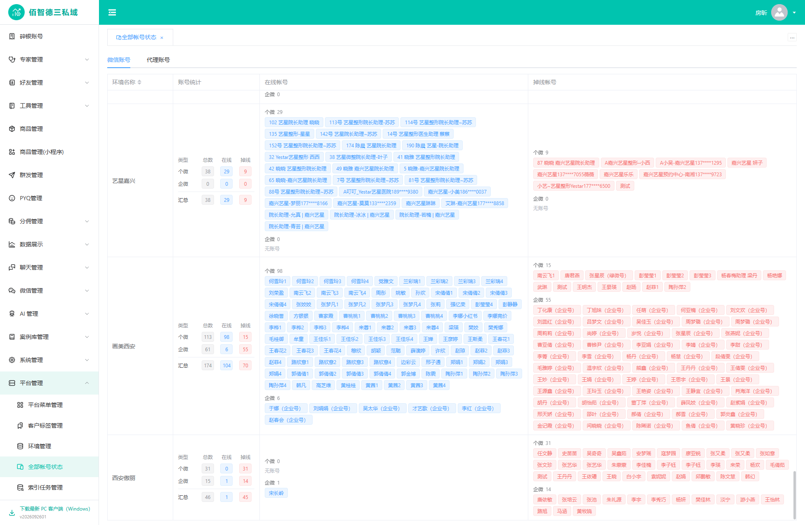

# 全部账号状态：个微、企微与汇总

`SPEC-SUIYIN-ADMIN-ACCOUNT-TYPE-001@0.2.0` · 静态原型版本包 · 2026-10-02  
固定发布标签：`v2026100201-admin-account-type-status`

平台管理员在佰智德三 Admin 的“平台管理 → 全部账号状态”中，可分别查看每个环境个微、企微的总数、在线数和掉线数，再核对汇总；在线与掉线名单各按两类分组。账号创建时已确定类型，没有第三业务分类。原排序、页签滚动位置、冻结表头与代理页签保持。

## 合同入口

- [SPEC](spec.md)：唯一行为真源，R001–R006与六项验收。
- [Plan](plan.md) / [Tasks](tasks.md)：已批准的静态实现范围与任务记录。
- [来源收敛](source-convergence.md)：旧第三分类、状态来源、整行快照与旧文档的替代关系。
- [Issue Handoff](issue-handoff.md) / [Test Contract](test-contract.md)：工程切片和测试Oracle。
- [原型验收记录](verification.md)：当前完整结果置顶，其后的历史记录保留明确历史标签。
- [文件清单与SHA-256](remote-sdd-package.json)：本包文件内容的完整性清单；该清单本身的哈希由独立交付回执记录。

工程Issue已创建：[PetWebOrg/suiyin-admin#458](https://github.com/PetWebOrg/suiyin-admin/issues/458)，提出环境佰智德三、提出人房昕、指派房昕（`xfang9528-glitch`）；工程平台为PC，具体界面为Admin管理页。Handoff为issued、切片为created；生产测试仍为planned，生产实现、审核和上线均由正式工程流程完成。

**这是原型和工程需求交接包，不是生产功能交付。** 正式Admin必须按稳定账号ID读取创建时已保存类型；本地证据中的精确名称多重集合匹配仅用于构建静态Mock，不得用于生产身份判断。43环境、画美174条及代理118卡均为本次验收快照，不得硬编码为生产值。

## 公开数据与证据边界

本轮公开静态样例包含 **43个环境、1,139个账号、118个代理卡片**。账号汇总为1,139/799/340（总数/在线/掉线）；个微970/748/222、企微169/51/118。数量、状态、创建类型、原有顺序与重名条目均保留。

公开投影对账号名中 **13处完整11位手机号** 遮罩为前三位、四个星号和后四位；不是把13个账号删除。普通账号名称保留，完整手机号检测为0，内部类型来源、快照证据元数据和本机证据路径不进入公开运行数据。详见[公开投影审计](evidence/public-projection-audit.json)。

原始DOM、原始采集截图、内部分类报告/数据、历史provider证据、用户确认名单、连接配置和凭据均不包含在本包。15个旧账号槽位的类型依据用户明确确认，与本次线上读取及3条历史显式类型证据区分；不将确认来源冒充为当日线上采得。

本包只包含下面的公开投影截图。它们来自完整43环境的最终公开Mock；没有临时替换成两行fixture。SPEC/Plan/verification中的`captures/`、内部报告和本机路径为本地证据指针，相关原始材料有意不上传，不能把这些指针理解为本包附件。

## 已执行的原型验证

| 验证范围 | 结果 | 证据 |
|---|---|---|
| 类型覆盖、计数、重名、空环境、类型拒绝、长名称、排序/页签/代理 | 12组通过，43行完整覆盖，无脚本异常及外部请求 | [组件结果](evidence/component-verification.json) |
| 隔离fixture：同名两类型、非法计数、sticky及父路由失败恢复 | 8组通过，首次失败和重绘失败都不回退旧演示数据 | [集成结果](evidence/component-integration-verification.json) |
| HTTP普通Shell、HTTP inline、file inline三入口 | 三入口均通过43行/1139账号/118代理及排序、滚动、隐私投影校验 | [发行入口结果](evidence/inline-delivery-verification.json) |
| 名称手机号遮罩 | 13处遮罩，完整手机号0，类型/计数/重名保持，内部证据元数据排除 | [公开投影审计](evidence/public-projection-audit.json) |
| 艺星长名单与画美环境 | 公开完整数据的视觉截图；长名单分类及汇总可读 | [艺星](evidence/full-data-yestar.png)、[画美](evidence/full-data-huamei.png) |

13项本地构建自测的事实记录在verification中；包含原始来源处理的分类builder和分类数据没有随本包发布。以上原型检查不能作为生产CI或生产上线证明。

## 检查脚本与复核

`checks/`内保存三份实际执行的脚本原始字节快照：[组件](checks/check-classification-preview.cjs)、[集成](checks/check-classification-integration.cjs)、[三入口发行](checks/check-inline-delivery.cjs)。组件和集成使用独立headless内存fixture，运行时不改源数据，并拦截外部网络；发行检查只读已经公开的Mock。

这三份脚本是本轮执行证据，依赖原本机Node、Playwright及Google Chrome环境，不是跨机器免配置的生产测试。前两份保留原执行机Playwright路径和`http://127.0.0.1:5200`入口；复核时需在工作副本适配依赖路径并以原型仓为静态服务根目录。发行检查可通过`ADMIN_PREVIEW_ORIGIN`与`ADMIN_PROTOTYPE_ROOT`指定入口和原型目录。不要为复跑改写本标签下的归档文件；新结果另行保存。

本包7份canonical文档及所有复制附件按原始字节校验。`validate-remote-sdd-package.mjs`只核对本地包结构、版本和声明；真实远端推送、固定标签链接可访问性以及Issue后置门禁，由发布后的独立delivery receipt记录。本包不预填远端验证成功。
