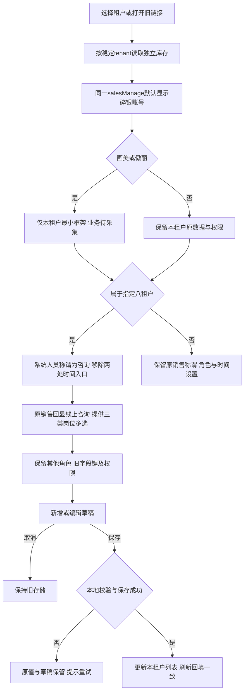
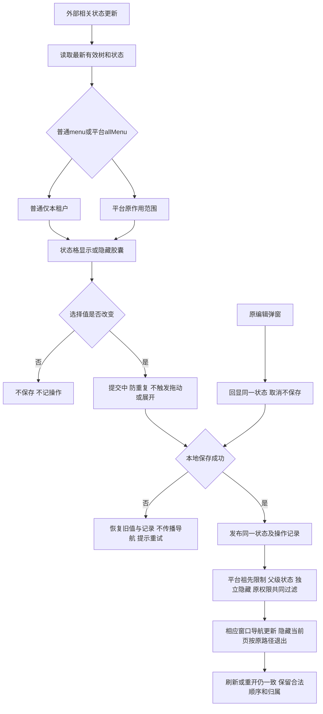

# 碎银账号、咨询岗位与菜单状态流程

更新：2026-09-30。执行[076@1.0.1](../docs/sdd/SPEC-SUIYIN-ADMIN-076/1.0.1/spec.md)与[077@1.0.1](../docs/sdd/SPEC-SUIYIN-ADMIN-077/1.0.1/spec.md)，范围及来源见[产品说明](../prd/admin-account-menu-status.md)。所有保存为本地原型，不写真实后台。

## 租户与账号呈现

八租户为六个现有艺星及画美西安、傲丽西安。时间入口移除覆盖账号顶部、系统设置及可达表单；历史值不回填、不校验、不随新表单提交。上班记录、在线状态和离开状态可转交保持。用户文本、销售额等指标及其他九租户称谓不改；新增岗位不自动授权。

## 菜单状态直接保存

图中编辑弹窗仅在用户确认保存时进入保存节点，取消直接保持现状。胶囊的显示选中不等于实际导航可见；恢复父级不清除子项独立隐藏。普通六列、平台九列、冻结表头、键盘焦点、行操作和拖动保持。平台默认与租户显式顺序/归属覆盖沿用060/068，不借状态切换清空。

用户本轮工程授权仅覆盖时间入口移除和胶囊两项；账号命名、两新租户及咨询岗位均为本次原型交付范围，不自动扩为工程实施任务。
