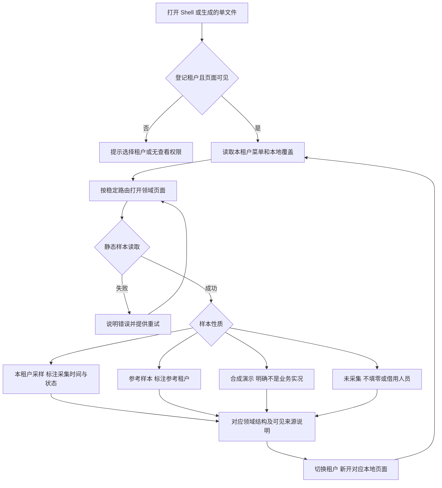
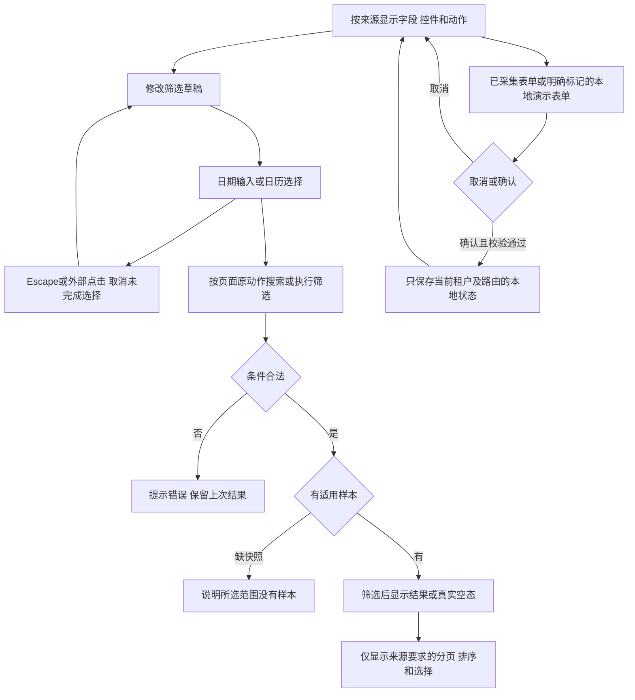
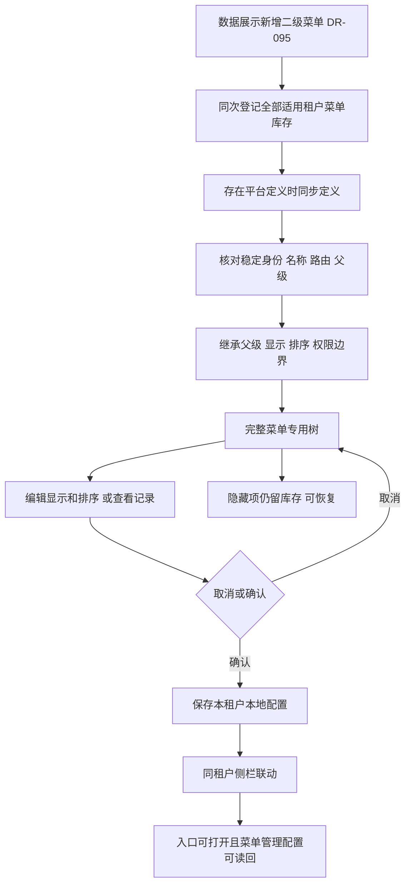
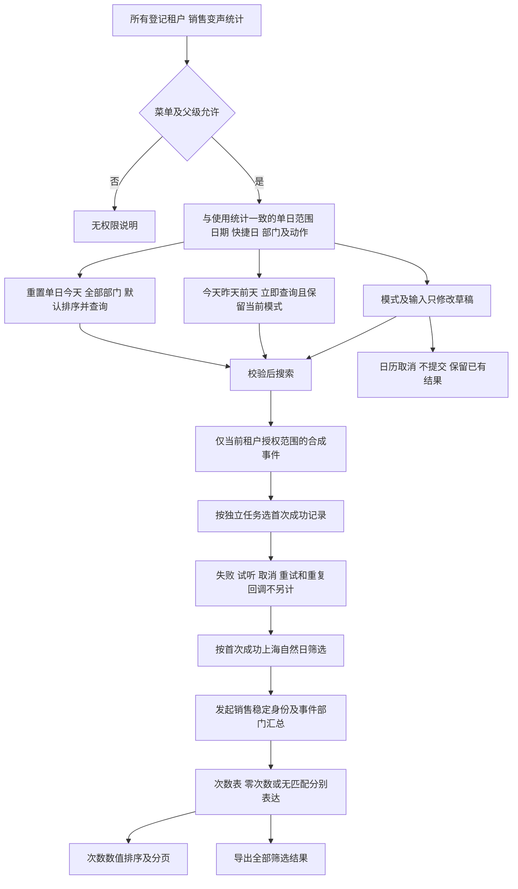
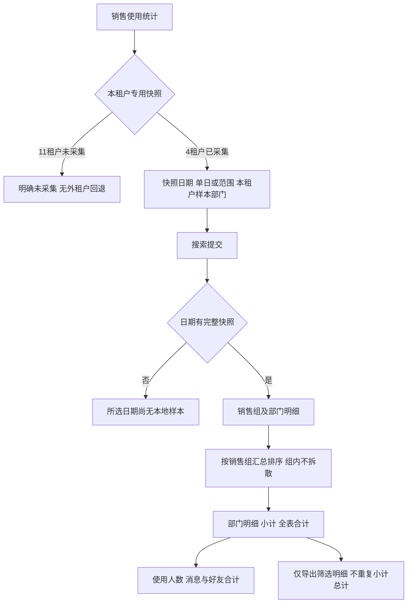
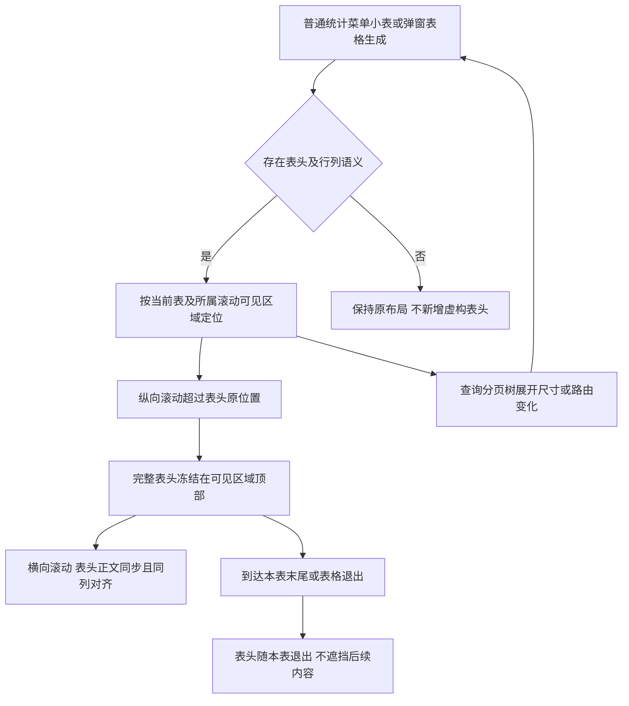
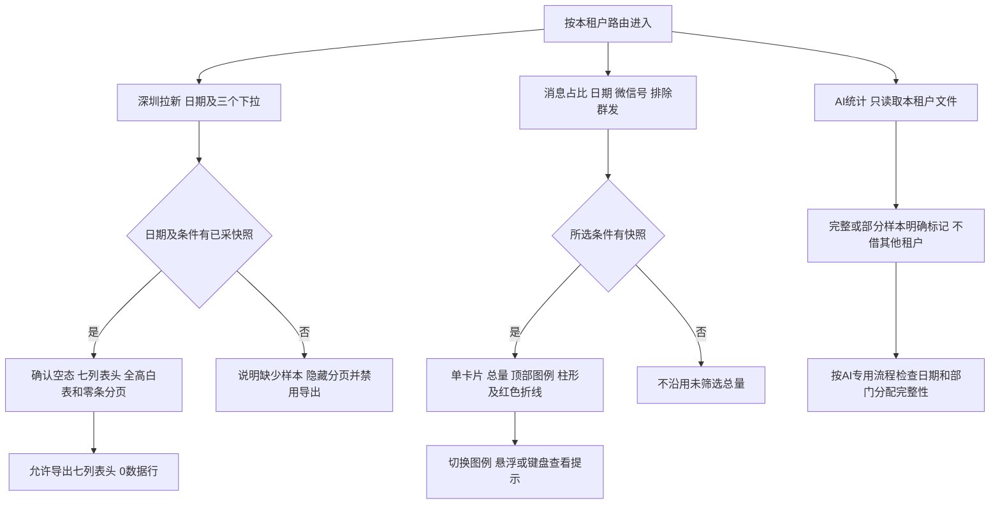
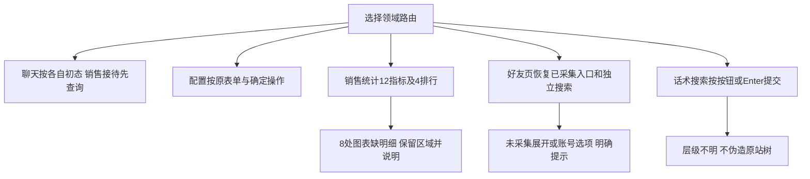
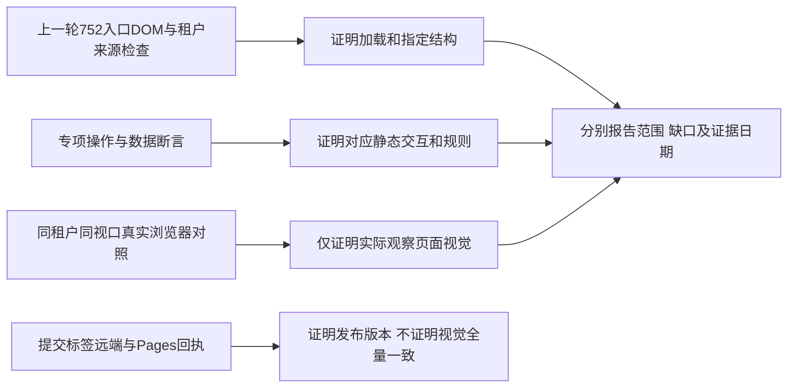

# 管理后台交互流程

更新：2026-09-20。静态原型共 15 租户、765 入口、85 路由；合同为 051@1.1.0、052@1.2.0、053@1.0.2、054@1.0.0、055@1.1.0、056@1.0.0、058@1.2.0，见 [合同入口](../README.md)。以下流程均不写真实后台。

## 入口、租户与证据

原始快照中的加载中不能判成确认空态。新窗口被浏览器阻止时提供目标链接。参考内容不授权跨租户借入实体选项；销售使用统计和 AI辅助统计没有参考租户数据回退。四页默认视图依据 [本轮发布勘误](../docs/sdd/pixel-correction-20260920.md)。

## 查询与本地编辑

## 数据展示与菜单管理同步

平台父级级联阻止自身或后代形成循环；本地分配先展示差异和影响租户，再确认。删除指明对象与影响范围，取消不修改；不借此开放隐藏父菜单或改变真实权限。

## 销售变声统计

单日仅显示开始日；范围显示起止日，切回单日以开始日归并起止。日期和部门编辑、模式切换不提前查询；非法范围保留已有结果。多工作账号归属同一销售，消息发送是否成功不改变计数。读取错误显示重试，不能将失败显示为全员 0。两页筛选一致不混用数据：变声基于本租户合成事件的运行日，使用统计基于本租户快照日。

## 销售使用统计

萌爪采集为空与未采集不同。此页无通用分页、汇总卡或列设置；变声页保留其已批准分页，不机械照抄。

## 全表格滚动列标题

多层表头整组冻结，保留原排序、选择和焦点操作；日历、下拉与弹窗不被表头覆盖。短表不增加行或强造滚动；该交互不改变业务结果和分页。

## 拉新、消息占比和 AI 统计的样本边界

拉新确认空态只适用于深圳已保存的 09-18/09-20 默认条件；其他日期和筛选不推断。消息占比深圳数据窗口仍为 09-12 至 18，不把参考截图 09-14 至 20 的总量混入。AI 22 行为截图完整可见部分，部门拆分缺采不能归给首部门。详见 [AI 流程](ai-assisted-message-stats.md)。

## AI费用与分类趋势

「AI管理 → AI费用统计」仅复用13个已有父级，菜单隐藏与本地直链门禁一致。提交日期后，图表、五类四列表格及合计共用82天固定样本；指标与类别仅重绘趋势，模型来自查询记录快照。未知费用、部分值和缺日期各自表达，不补成零或完整实线。完整查询、计数费用与模型链路见 [费用交互流程](ai-cost-stats.md)，业务合同为 [058@1.2.0](../docs/sdd/SPEC-SUIYIN-ADMIN-058/1.2.0/spec.md)。

## 领域页面与缺证据状态

## 验收分层

上一轮本地 Chrome 已盘点 752 个入口、665 张表格，实际滚动 333 个场景无冻结失败或脚本错误，另有筛选 8/8、冻结 22 项断言和独立 9/9 检查。上一轮保留四页独立本地 Chrome 截图、与用户实站截图同尺寸测量及交互检查；实站 Chrome 连接及访问授权尚未完成，在线复核仍有缺口。此发布保存当前迭代，不能用结构或发布回执宣称 752 入口逐像素一致。
