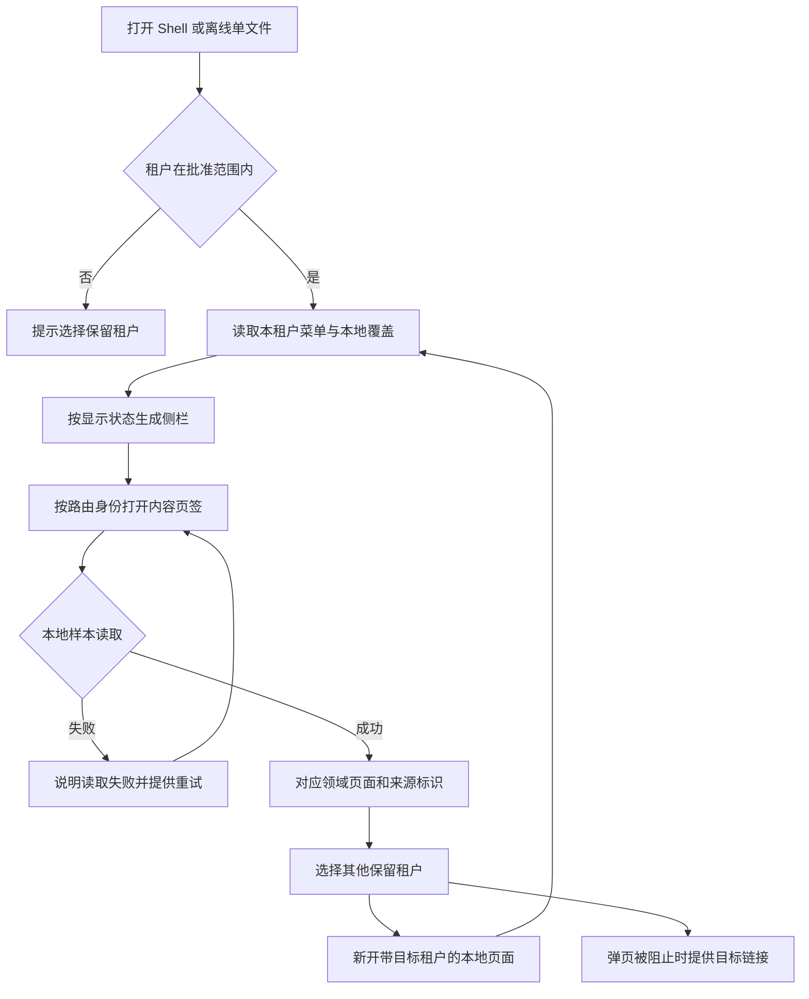
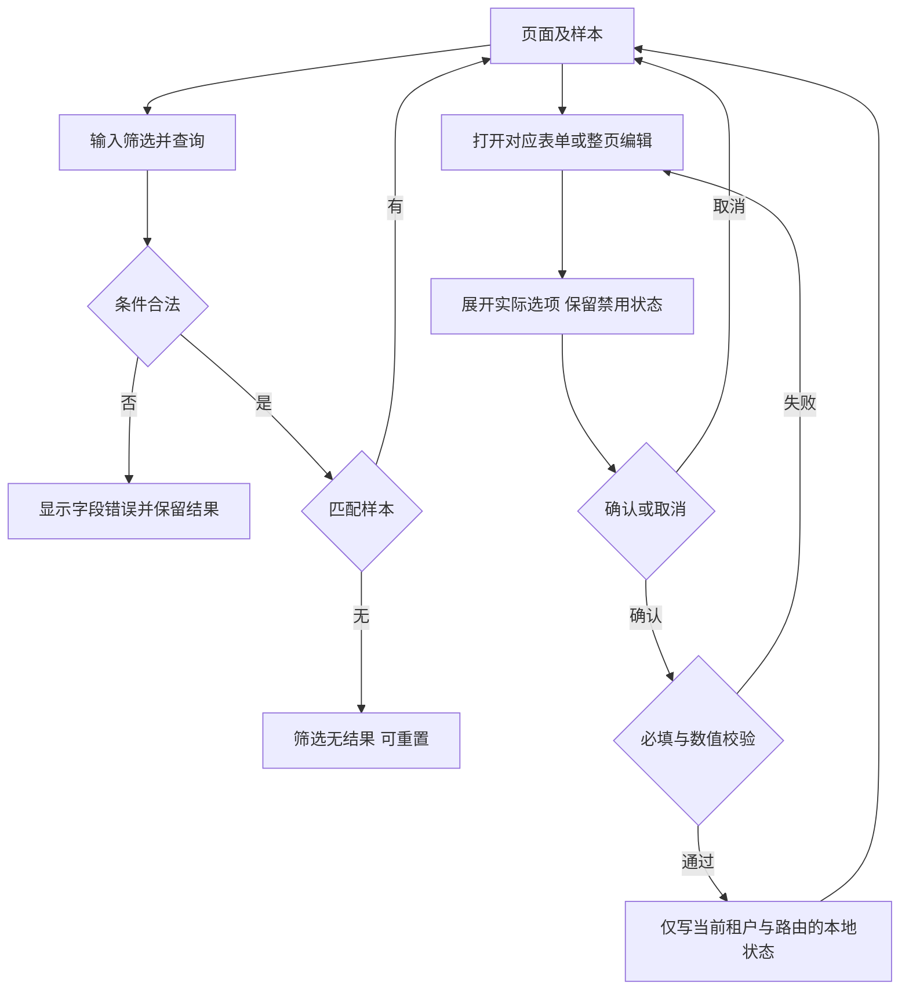
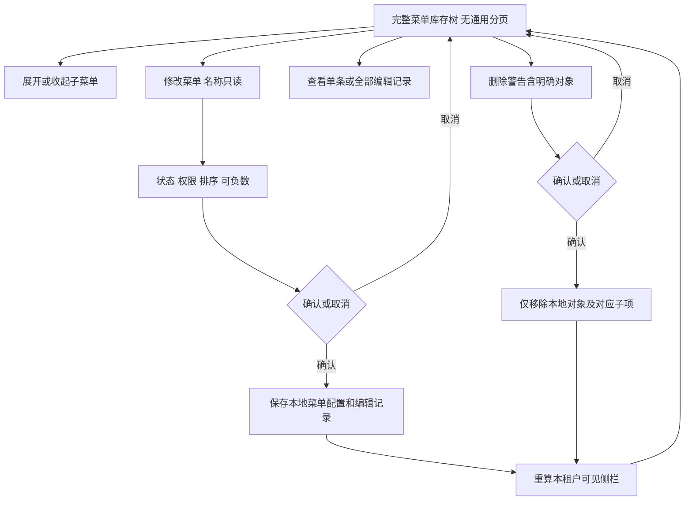
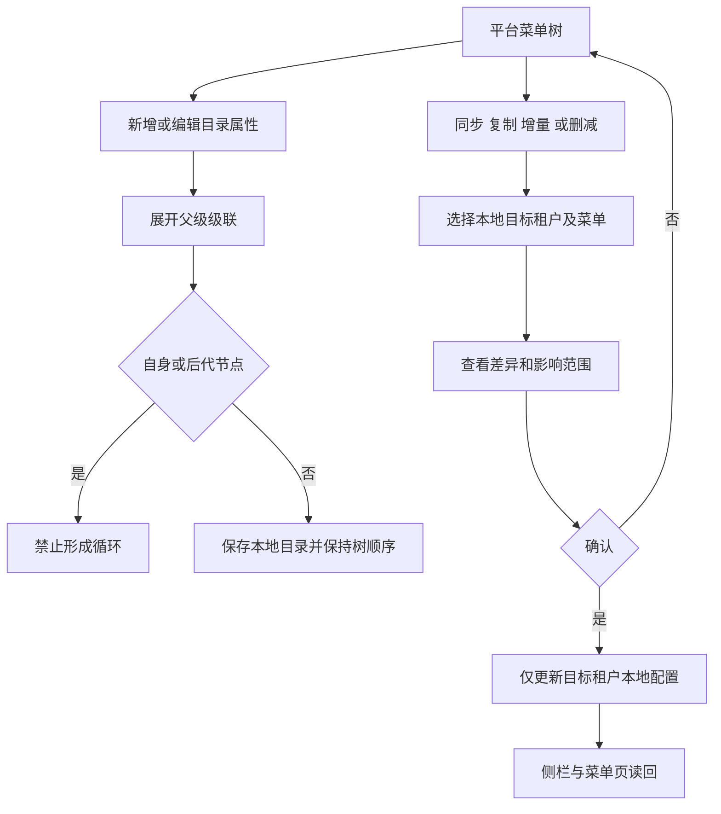
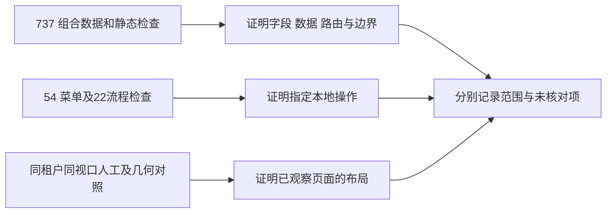

# 管理后台内容与菜单交互流程

行为合同：[SPEC-SUIYIN-ADMIN-051@1.1.0](../docs/sdd/SPEC-SUIYIN-ADMIN-051/1.1.0/spec.md)。以下全部为静态原型中的操作。

## 入口、租户与内容

```mermaid
flowchart TD
    Start[打开 Shell 或离线单文件] --> Tenant{租户在批准范围内}
    Tenant -->|否| Denied[提示选择保留租户]
    Tenant -->|是| Config[读取本租户菜单与本地覆盖]
    Config --> Visible[按显示状态生成侧栏]
    Visible --> Route[按路由身份打开内容页签]
    Route --> Load{本地样本读取}
    Load -->|失败| Retry[说明读取失败并提供重试]
    Retry --> Route
    Load -->|成功| Page[对应领域页面和来源标识]
    Page --> Switch[选择其他保留租户]
    Switch --> New[新开带目标租户的本地页面]
    Switch --> Blocked[弹页被阻止时提供目标链接]
    New --> Config
```

## 本地表单与查询

```mermaid
flowchart TD
    List[页面及样本] --> Query[输入筛选并查询]
    Query --> Valid{条件合法}
    Valid -->|否| Error[显示字段错误并保留结果]
    Valid -->|是| Result{匹配样本}
    Result -->|无| Empty[筛选无结果 可重置]
    Result -->|有| List
    List --> Edit[打开对应表单或整页编辑]
    Edit --> Options[展开实际选项 保留禁用状态]
    Options --> Submit{确认或取消}
    Submit -->|取消| List
    Submit -->|确认| Check{必填与数值校验}
    Check -->|失败| Edit
    Check -->|通过| Save[仅写当前租户与路由的本地状态]
    Save --> List
```

## 菜单管理

```mermaid
flowchart TD
    Tree[完整菜单库存树 无通用分页] --> Expand[展开或收起子菜单]
    Tree --> Edit[修改菜单 名称只读]
    Edit --> Fields[状态 权限 排序 可负数]
    Fields --> Decision{确认或取消}
    Decision -->|取消| Tree
    Decision -->|确认| Persist[保存本地菜单配置和编辑记录]
    Persist --> Nav[重算本租户可见侧栏]
    Nav --> Tree
    Tree --> Records[查看单条或全部编辑记录]
    Tree --> Delete[删除警告含明确对象]
    Delete --> D{确认或取消}
    D -->|取消| Tree
    D -->|确认| LocalDelete[仅移除本地对象及对应子项]
    LocalDelete --> Nav
```

## 平台菜单与分配演示

```mermaid
flowchart TD
    Platform[平台菜单树] --> Edit[新增或编辑目录属性]
    Edit --> Parent[展开父级级联]
    Parent --> Cycle{自身或后代节点}
    Cycle -->|是| Prevent[禁止形成循环]
    Cycle -->|否| Save[保存本地目录并保持树顺序]
    Platform --> Action[同步 复制 增量 或删减]
    Action --> Targets[选择本地目标租户及菜单]
    Targets --> Preview[查看差异和影响范围]
    Preview --> Confirm{确认}
    Confirm -->|否| Platform
    Confirm -->|是| Apply[仅更新目标租户本地配置]
    Apply --> Nav[侧栏与菜单页读回]
```

## 证据判定

```mermaid
flowchart LR
    Data[737 组合数据和静态检查] --> DataResult[证明字段 数据 路由与边界]
    Flow[54 菜单及22流程检查] --> FlowResult[证明指定本地操作]
    Visual[同租户同视口人工及几何对照] --> VisualResult[证明已观察页面的布局]
    DataResult --> Limits[分别记录范围与未核对项]
    FlowResult --> Limits
    VisualResult --> Limits
```
