# 管理后台交互流程

更新：2026-09-28。深圳回访规则执行 [071@1.1.0](../docs/sdd/SPEC-SUIYIN-ADMIN-071/1.1.0/README.md)。2026-09-27录音/喜报三新页、对应入口迁移与本地演示边界继续执行 [REFRESH-001@0.2.0](../docs/sdd/SPEC-SUIYIN-ADMIN-REFRESH-001/0.2.0/README.md)，既有页面刷新继续原合同。普通菜单与平台/租户优先级执行068@1.0.0，平台拖动继续060@1.1.0；预约记录图表按062@1.0.0。当前静态原型共15租户、797入口、89路由；783个源队列入口与741可见已采/42隐藏口径不变，另13个AI费用及1个回访规则属于原型扩展。其余合同为051@1.1.0、052@1.2.0、053@1.0.2、054@1.0.0、055@1.1.0、056@1.0.0、058@1.2.0，见[合同入口](../README.md)。以下流程均不写真实后台。

## 入口、租户与证据

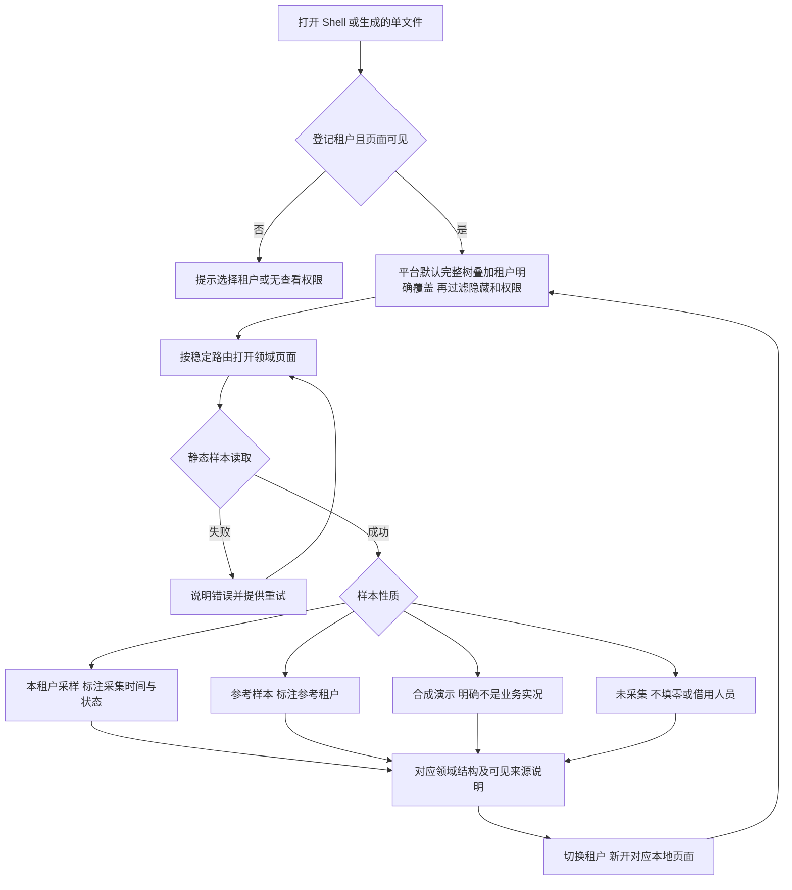
```mermaid
flowchart TD
    Start[打开 Shell 或生成的单文件] --> Tenant{登记租户且页面可见}
    Tenant -->|否| Denied[提示选择租户或无查看权限]
    Tenant -->|是| Config[平台默认完整树叠加租户明确覆盖 再过滤隐藏和权限]
    Config --> Route[按稳定路由打开领域页面]
    Route --> Load{静态样本读取}
    Load -->|失败| Retry[说明错误并提供重试]
    Retry --> Route
    Load -->|成功| Source{样本性质}
    Source --> Captured[本租户采样 标注采集时间与状态]
    Source --> Reference[参考样本 标注参考租户]
    Source --> Mock[合成演示 明确不是业务实况]
    Source --> Missing[未采集 不填零或借用人员]
    Captured --> Page[对应领域结构及可见来源说明]
    Reference --> Page
    Mock --> Page
    Missing --> Page
    Page --> Switch[切换租户 新开对应本地页面]
    Switch --> Config
```

原始快照中的加载中不能判成确认空态。新窗口被浏览器阻止时提供目标链接。参考内容不授权跨租户借入实体选项；销售使用统计和 AI辅助统计没有参考租户数据回退。四页旧默认视图保留为历史，见 [2026-09-20发布勘误](../docs/sdd/pixel-correction-20260920.md)。

## 回访规则与时间节点

仅深圳「聊天管理 → 回访规则」（`revisitRules`）适用。一条规则包含多个节点，节点复用21项选中和26项排除维度；1.0.0逐个节点拆顶层规则的流程已由071@1.1.0替代。菜单不移动到群发，不增加群发规则或其他租户入口。

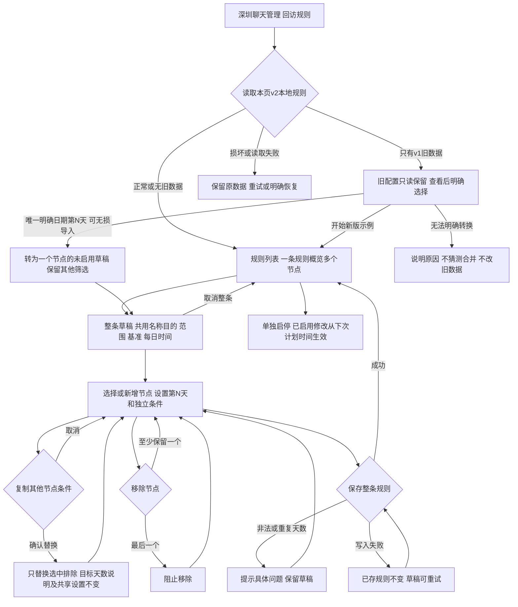
```mermaid
flowchart TD
    Entry[深圳聊天管理 回访规则] --> Read{读取本页v2本地规则}
    Read -->|正常或无旧数据| List[规则列表 一条规则概览多个节点]
    Read -->|只有v1旧数据| Legacy[旧配置只读保留 查看后明确选择]
    Legacy -->|开始新版示例| List
    Legacy -->|唯一明确日期第N天 可无损导入| Import[转为一个节点的未启用草稿 保留其他筛选]
    Legacy -->|无法明确转换| Keep[说明原因 不猜测合并 不改旧数据]
    Read -->|损坏或读取失败| Error[保留原数据 重试或明确恢复]
    List --> Edit[整条草稿 共用名称目的 范围 基准 每日时间]
    Import --> Edit
    Edit --> Node[选择或新增节点 设置第N天和独立条件]
    Node --> Copy{复制其他节点条件}
    Copy -->|确认替换| Snapshot[只替换选中排除 目标天数说明及共享设置不变]
    Copy -->|取消| Node
    Snapshot --> Node
    Node --> Remove{移除节点}
    Remove -->|至少保留一个| Node
    Remove -->|最后一个| Block[阻止移除]
    Block --> Node
    Node --> Save{保存整条规则}
    Save -->|非法或重复天数| Fix[提示具体问题 保留草稿]
    Fix --> Node
    Save -->|写入失败| Retry[已存规则不变 草稿可重试]
    Retry --> Save
    Save -->|成功| List
    Edit -->|取消整条| List
    List --> Enable[单独启停 已启用修改从下次计划时间生效]
```

复制后节点条件互不联动，取消整条编辑不会遗留新增/删除节点或复制结果；保存成功才改变当前浏览器规则。v1原始内容一直保留，v2和QA存储分别隔离。节点第N天与每日几点筛选分开，不用前一节点是否完成作为后续节点的前置。

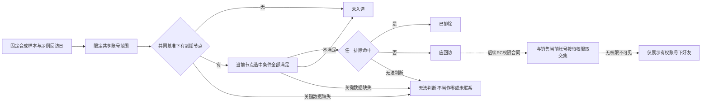
```mermaid
flowchart LR
    Sample[固定合成样本与示例回访日] --> Scope[限定共享账号范围]
    Scope --> Due{共同基准下有到期节点}
    Due -->|无| Skip[未入选]
    Due -->|有| Include[当前节点选中条件全部满足]
    Include --> Exclude{任一排除命中}
    Exclude -->|是| Excluded[已排除]
    Exclude -->|否| Included[应回访]
    Due -->|关键数据缺失| Unknown[无法判断 不当作零或未联系]
    Include -->|不满足| Skip
    Include -->|关键数据缺失| Unknown
    Exclude -->|无法判断| Unknown
    Included -. 后续PC权限合同 .-> Permission[与销售当前账号接待权限取交集]
    Permission -. 无权限不可见 .-> Visible[仅展示有权账号下好友]
```

上图实线只演示本地条件计算及可解释的结果，日期或配置错误单独报错；虚线是后续PC可见性合同，当前未接真实名单或权限服务。不真实调度、不发送、不自动分配或实现完成状态同步。

## 查询与本地编辑

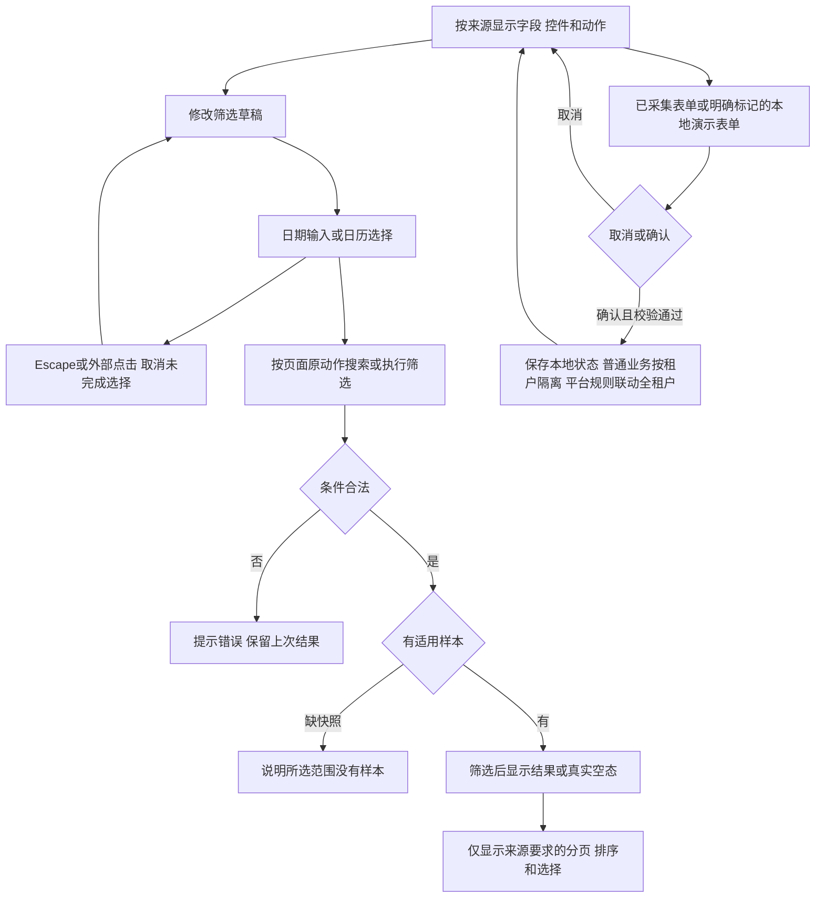
```mermaid
flowchart TD
    Page[按来源显示字段 控件和动作] --> Draft[修改筛选草稿]
    Draft --> Calendar[日期输入或日历选择]
    Calendar --> Cancel[Escape或外部点击 取消未完成选择]
    Cancel --> Draft
    Calendar --> Submit[按页面原动作搜索或执行筛选]
    Submit --> Valid{条件合法}
    Valid -->|否| Error[提示错误 保留上次结果]
    Valid -->|是| Coverage{有适用样本}
    Coverage -->|缺快照| NoSnapshot[说明所选范围没有样本]
    Coverage -->|有| Result[筛选后显示结果或真实空态]
    Result --> Tools[仅显示来源要求的分页 排序和选择]
    Page --> Edit[已采集表单或明确标记的本地演示表单]
    Edit --> Choice{取消或确认}
    Choice -->|取消| Page
    Choice -->|确认且校验通过| Save[保存本地状态 普通业务按租户隔离 平台规则联动全租户]
    Save --> Page
```

## 数据展示与菜单管理同步

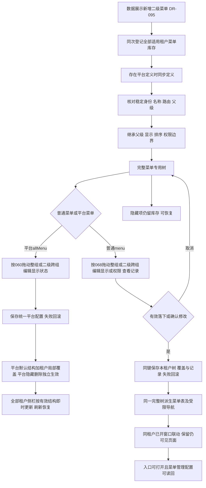
```mermaid
flowchart TD
    New[数据展示新增二级菜单 DR-095] --> Register[同次登记全部适用租户菜单库存]
    Register --> Platform[存在平台定义时同步定义]
    Platform --> Identity[核对稳定身份 名称 路由 父级]
    Identity --> Existing[继承父级 显示 排序 权限边界]
    Existing --> Tree[完整菜单专用树]
    Tree --> Scope{普通菜单或平台菜单}
    Scope -->|普通menu| Edit[按068拖动整组或二级跨组 编辑显示或权限 查看记录]
    Scope -->|平台allMenu| Drag[按060拖动整组或二级跨组 编辑显示状态]
    Drag --> PlatformSave[保存统一平台配置 失败回滚]
    PlatformSave --> Resolve[平台默认结构加租户局部覆盖 平台隐藏删除独立生效]
    Resolve --> AllNav[全部租户侧栏按有效结构即时更新 刷新恢复]
    Edit --> Decision{有效落下或确认修改}
    Decision -->|取消| Tree
    Decision -->|是| Local[同键保存本租户树 覆盖与记录 失败回滚]
    Local --> TenantResolve[同一完整树派生菜单表及受限导航]
    TenantResolve --> Nav[同租户已开窗口联动 保留仍可见页面]
    Nav --> Check[入口可打开且菜单管理配置可读回]
    Tree --> Hidden[隐藏项仍留库存 可恢复]
```

普通menu不再输入排序号，完整交互见[各租户菜单流程](tenant-menu-drag.md)。租户只冻结明确调整的同级顺序和被跨组移动项的父级；平台当前祖先链隐藏、删除及权限不能通过跨组绕过。平台父级级联阻止自身或后代形成循环；本地分配先展示差异和影响租户，再确认。删除指明对象与影响范围，取消不修改。

## 销售变声统计

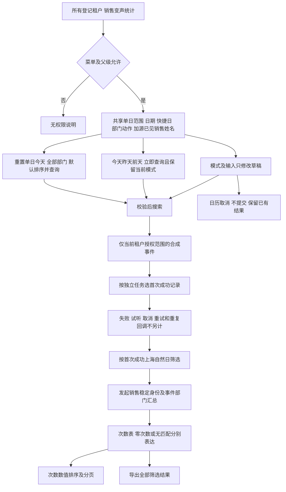
```mermaid
flowchart TD
    Entry[所有登记租户 销售变声统计] --> Permission{菜单及父级允许}
    Permission -->|否| Denied[无权限说明]
    Permission -->|是| Form[共享单日范围 日期 快捷日 部门动作 加源已见销售姓名]
    Form --> Draft[模式及输入只修改草稿]
    Draft --> Search[校验后搜索]
    Form --> Quick[今天昨天前天 立即查询且保留当前模式]
    Quick --> Search
    Form --> Reset[重置单日今天 全部部门 默认排序并查询]
    Reset --> Search
    Draft --> Cancel[日历取消 不提交 保留已有结果]
    Search --> Tenant[仅当前租户授权范围的合成事件]
    Tenant --> Dedup[按独立任务选首次成功记录]
    Dedup --> Exclude[失败 试听 取消 重试和重复回调不另计]
    Exclude --> Time[按首次成功上海自然日筛选]
    Time --> Aggregate[发起销售稳定身份及事件部门汇总]
    Aggregate --> Result[次数表 零次数或无匹配分别表达]
    Result --> Sort[次数数值排序及分页]
    Result --> Export[导出全部筛选结果]
```

单日仅显示开始日；范围显示起止日，切回单日以开始日归并起止。日期和部门编辑、模式切换不提前查询；非法范围保留已有结果。多工作账号归属同一销售，消息发送是否成功不改变计数。读取错误显示重试，不能将失败显示为全员 0。两页筛选一致不混用数据：变声基于本租户合成事件的运行日，使用统计基于本租户快照日。

## 销售使用统计

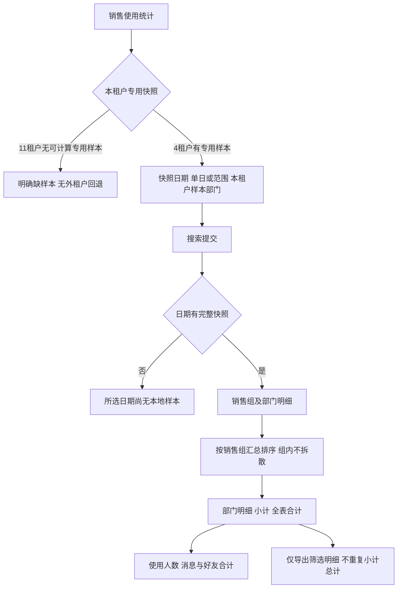
```mermaid
flowchart TD
    Entry[销售使用统计] --> Model{本租户专用快照}
    Model -->|11租户无可计算专用样本| Missing[明确缺样本 无外租户回退]
    Model -->|4租户有专用样本| Draft[快照日期 单日或范围 本租户样本部门]
    Draft --> Search[搜索提交]
    Search --> Complete{日期有完整快照}
    Complete -->|否| NoSnapshot[所选日期尚无本地样本]
    Complete -->|是| Groups[销售组及部门明细]
    Groups --> Sort[按销售组汇总排序 组内不拆散]
    Sort --> Table[部门明细 小计 全表合计]
    Table --> Summary[使用人数 消息与好友合计]
    Table --> CSV[仅导出筛选明细 不重复小计总计]
```

萌爪采集为空与未采集不同。此页无通用分页、汇总卡或列设置；变声页保留其已批准分页，不机械照抄。

## 全表格滚动列标题

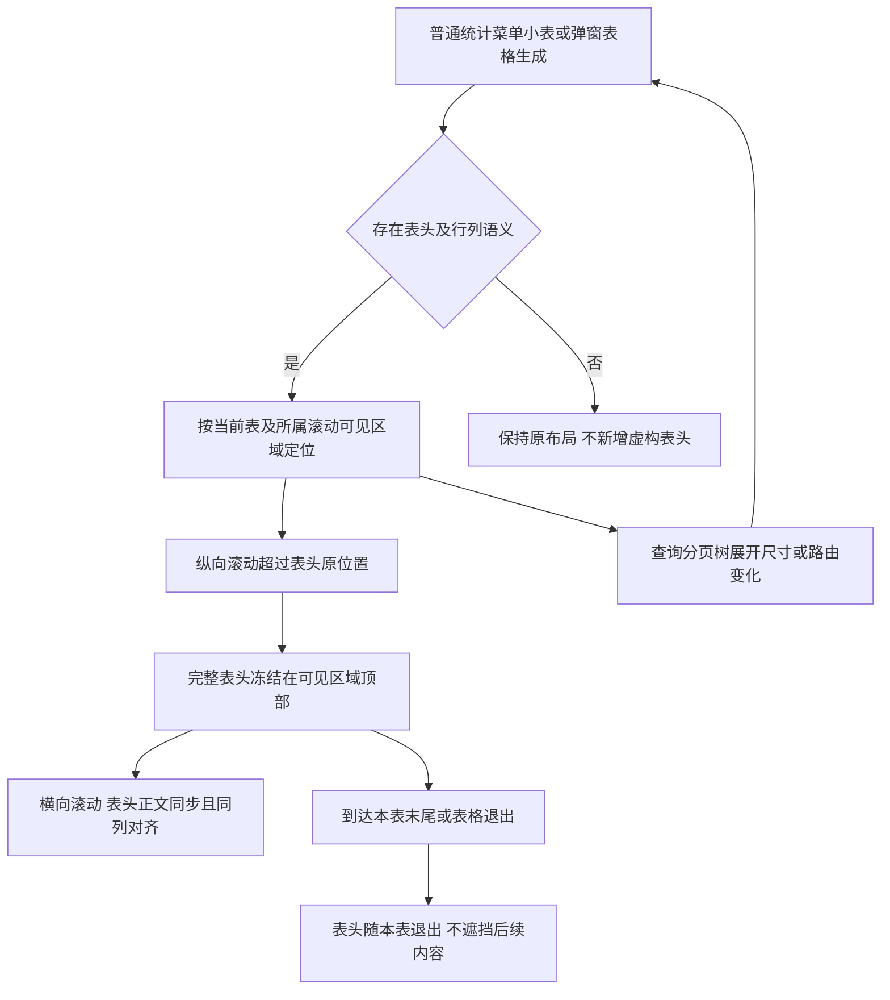
```mermaid
flowchart TD
    Render[普通统计菜单小表或弹窗表格生成] --> Head{存在表头及行列语义}
    Head -->|是| Observe[按当前表及所属滚动可见区域定位]
    Observe --> Scroll[纵向滚动超过表头原位置]
    Scroll --> Freeze[完整表头冻结在可见区域顶部]
    Freeze --> Horizontal[横向滚动 表头正文同步且同列对齐]
    Freeze --> End[到达本表末尾或表格退出]
    End --> Leave[表头随本表退出 不遮挡后续内容]
    Observe --> Change[查询分页树展开尺寸或路由变化]
    Change --> Render
    Head -->|否| Unchanged[保持原布局 不新增虚构表头]
```

多层表头整组冻结，保留原排序、选择和焦点操作；日历、下拉与弹窗不被表头覆盖。短表不增加行或强造滚动；该交互不改变业务结果和分页。

## 拉新、消息占比和 AI 统计的样本边界

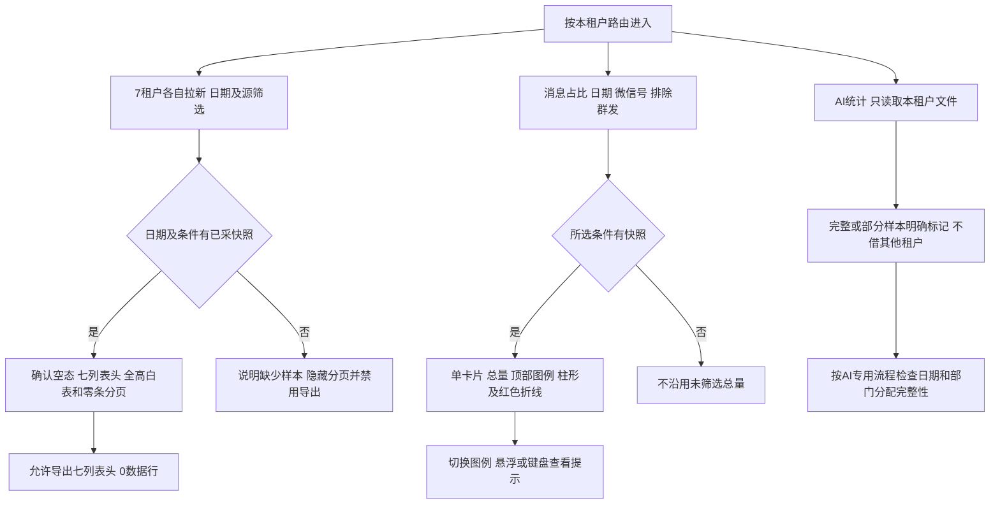
```mermaid
flowchart TD
    Route[按本租户路由进入] --> Recruitment[7租户各自拉新 日期及源筛选]
    Recruitment --> Observed{日期及条件有已采快照}
    Observed -->|是| Empty[确认空态 七列表头 全高白表和零条分页]
    Empty --> Export[允许导出七列表头 0数据行]
    Observed -->|否| Missing[说明缺少样本 隐藏分页并禁用导出]
    Route --> Message[消息占比 日期 微信号 排除群发]
    Message --> Coverage{所选条件有快照}
    Coverage -->|是| Chart[单卡片 总量 顶部图例 柱形及红色折线]
    Chart --> Inspect[切换图例 悬浮或键盘查看提示]
    Coverage -->|否| ChartMissing[不沿用未筛选总量]
    Route --> AI[AI统计 只读取本租户文件]
    AI --> Partial[完整或部分样本明确标记 不借其他租户]
    Partial --> AIFlow[按AI专用流程检查日期和部门分配完整性]
```

本轮拉新确认空态按7租户各自已采日期和条件保存；09-18/09-20的深圳证据仅作历史，其他日期和筛选不推断。消息占比深圳数据窗口仍为 09-12 至 18，不把参考截图 09-14 至 20 的总量混入。AI 22 行为截图完整可见部分，部门拆分缺采不能归给首部门。详见 [AI 流程](ai-assisted-message-stats.md)。

## AI费用与分类趋势

「AI管理 → AI费用统计」仅复用13个已有父级，菜单隐藏与本地直链门禁一致。提交日期后，图表、五类四列表格及合计共用82天固定样本；指标与类别仅重绘趋势，模型来自查询记录快照。未知费用、部分值和缺日期各自表达，不补成零或完整实线。完整查询、计数费用与模型链路见 [费用交互流程](ai-cost-stats.md)，业务合同为 [058@1.2.0](../docs/sdd/SPEC-SUIYIN-ADMIN-058/1.2.0/spec.md)。

## 领域页面与缺证据状态

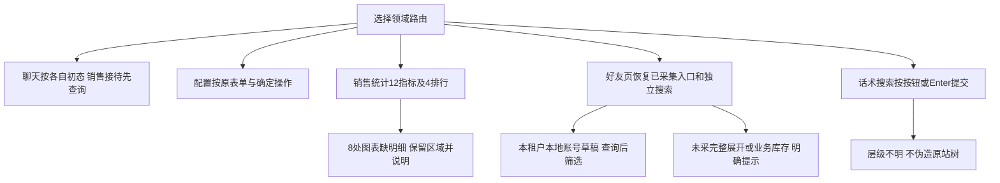
```mermaid
flowchart TD
    Route[选择领域路由] --> Chat[聊天按各自初态 销售接待先查询]
    Route --> Config[配置按原表单与确定操作]
    Route --> Dashboard[销售统计12指标及4排行]
    Dashboard --> ChartGap[8处图表缺明细 保留区域并说明]
    Route --> Friends[好友页恢复已采集入口和独立搜索]
    Friends --> Accounts[本租户本地账号草稿 查询后筛选]
    Friends --> ExpandGap[未采完整展开或业务库存 明确提示]
    Route --> Scripts[话术搜索按按钮或Enter提交]
    Scripts --> TreeGap[层级不明 不伪造原站树]
```

## 录音与喜报

录音与喜报三个新增页面的专用流程如下，仅按已核实入口在对应租户出现。

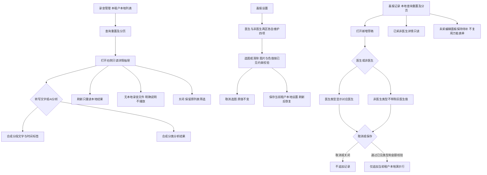
```mermaid
flowchart TD
    Recording[录音管理 本租户本地列表] --> Query[查询重置及分页]
    Query --> Detail[打开右侧只读详情抽屉]
    Detail --> Tabs{转写文字或AI分析}
    Tabs --> Text[合成分段文字与时间标签]
    Tabs --> Analysis[合成分类分析结果]
    Detail --> Refresh[刷新只重读本地结果]
    Detail --> Media[无本地录音文件 明确说明 不播放]
    Detail --> Close[关闭 保留原列表筛选]
    Settings[喜报设置] --> Type[医生与非医生两区各自维护四项]
    Type --> Asset[选图或清除 图片与色值按已见约束校验]
    Asset --> CancelFile[取消选图 原值不变]
    Asset --> LocalSave[保存当前租户本地设置 刷新后恢复]
    Records[喜报记录 本地查询重置及分页] --> Create[打开新增草稿]
    Create --> Kind{医生或非医生}
    Kind --> Doctor[医生类型显示对应医生]
    Kind --> Other[非医生类型不带陈旧医生值]
    Doctor --> Decide{取消或保存}
    Other --> Decide
    Decide -->|取消或关闭| Unchanged[不追加记录]
    Decide -->|通过已见类型和金额校验| Append[仅追加当前租户本地演示行]
    Records --> Read[已采非医生详情只读]
    Records --> Gap[未采编辑面板保持待补 不复用万能表单]
```

录音不提供真实媒体、上传、转写或分析任务；喜报不真实保存、生成或发送。图中保存只表示已批准的本浏览器租户隔离演示。未采的服务端校验和结果不扩写为真实能力。

## 验收分层

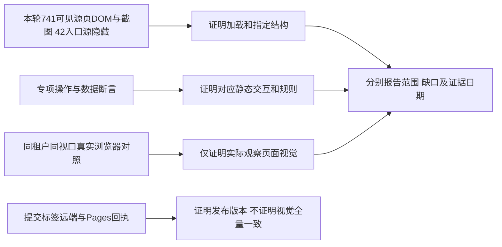
```mermaid
flowchart LR
    DOM[本轮741可见源页DOM与截图 42入口源隐藏] --> Structure[证明加载和指定结构]
    Flows[专项操作与数据断言] --> Behavior[证明对应静态交互和规则]
    Visual[同租户同视口真实浏览器对照] --> Pixels[仅证明实际观察页面视觉]
    Structure --> Report[分别报告范围 缺口及证据日期]
    Behavior --> Report
    Pixels --> Report
    Remote[提交标签远端与Pages回执] --> Delivery[证明发布版本 不证明视觉全量一致]
```

2026-09-27已采15租户导航及741个可见源页。395个通用列表、好友、统计和专用模块分别按同视口及DPR进行指定几何/交互检查，见[公开聚合摘要](../docs/verification/live-refresh-20260927/README.md)。未观察的展开状态、图表点和筛选区间仍有边界，不能用结构或发布回执宣称741页所有状态逐像素一致。752入口等2026-09-20数字仅作历史。

## 预约记录图表

四个既有预约记录入口默认列表，筛选提交后切换列表/图表保留结果与页码。每日预约柱形与期间累计折线都按上海预约时间，从全部匹配记录聚合；来源和缺日期单独表达。流程及边界见 [预约记录流程](appointment-chart.md)。
