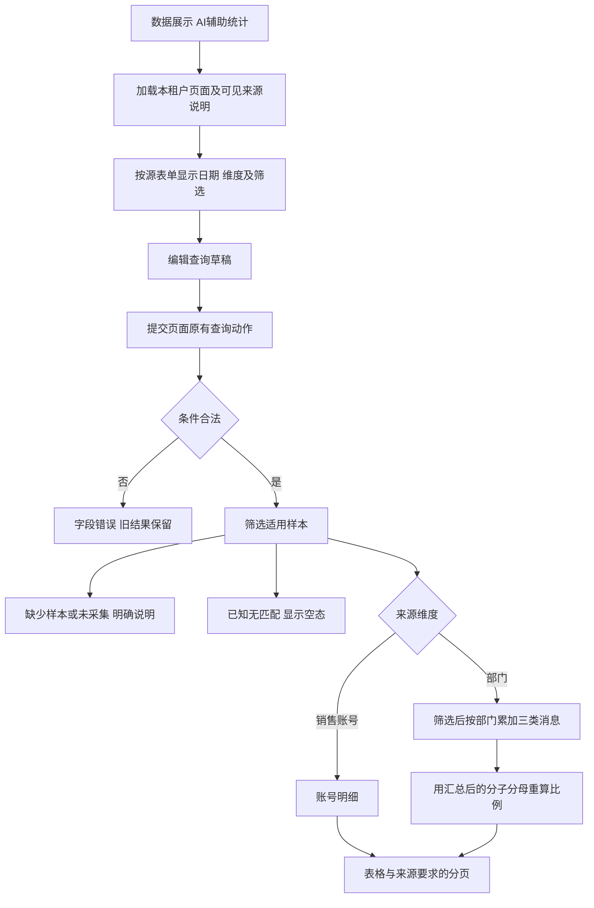
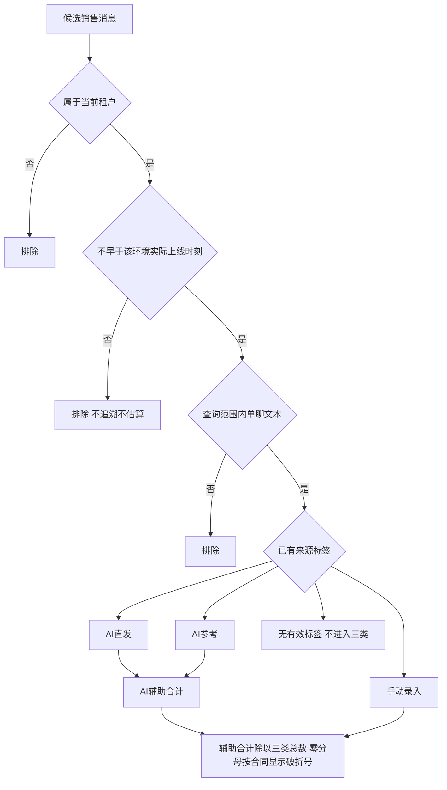

# AI 辅助消息使用统计流程

更新：2026-09-20。业务口径继续 009@1.0.0，当前 Shell 结构依 051@1.1.0、055/056@1.0.0。入口为 `aiAssistStats`；旧独立页的固定默认值和快捷日期组合不作为当前页面结构承诺。

## 原型查询与部门汇总

## 业务合同的数据边界

第二图是已批准业务合同，不能拿静态页面结构检查当作真实生产数据验收。当前原型参考和合成样本有来源标签；不展示消息正文，不据使用量推断客户升级、到店或成交效果。
