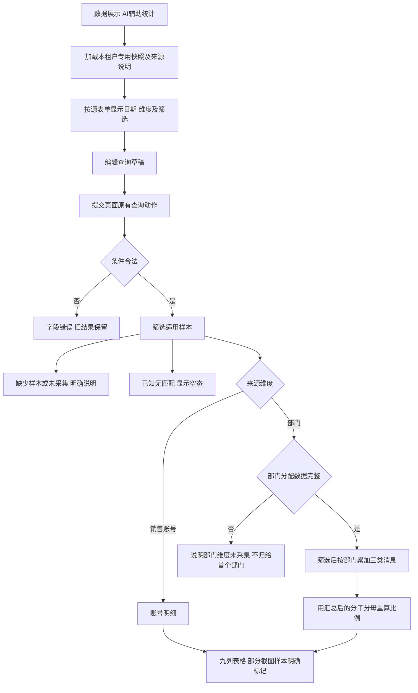
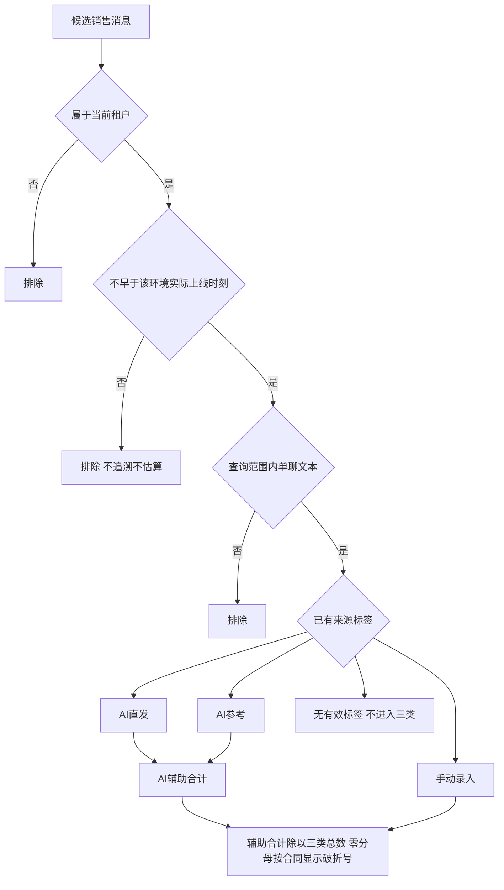

# AI 辅助消息使用统计流程

更新：2026-09-20。业务口径继续 009@1.0.0，当前 Shell 结构依 051@1.1.0、055@1.1.0、056@1.0.0。四页恢复说明见 [发布勘误](../docs/sdd/pixel-correction-20260920.md)。入口为 `aiAssistStats`；当前专用页只使用本租户快照，旧独立页与参考样本不再作为本页数据回退。

结果表格纵向滚动按 055@1.1.0 冻结表头；横向同步，查询重绘后继续生效，表格末尾退出，不改变统计结果与查询流程。

## 原型查询与部门汇总

## 业务合同的数据边界

第二图是已批准业务合同，不能拿静态页面结构检查当作真实生产数据验收。当前专用原型只读取本租户 captured、partial 或 not-captured 文件，不使用参考租户或合成数量回退。深圳 22 行为截图部分样本，日期和部门拆分缺采分别说明；不展示消息正文，不据使用量推断客户升级、到店或成交效果。
