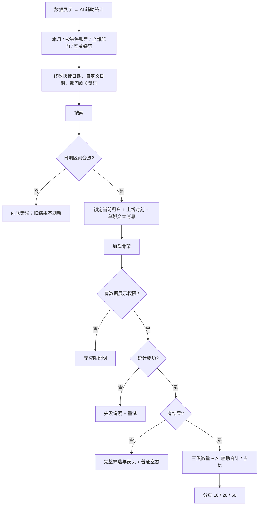
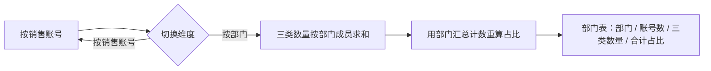
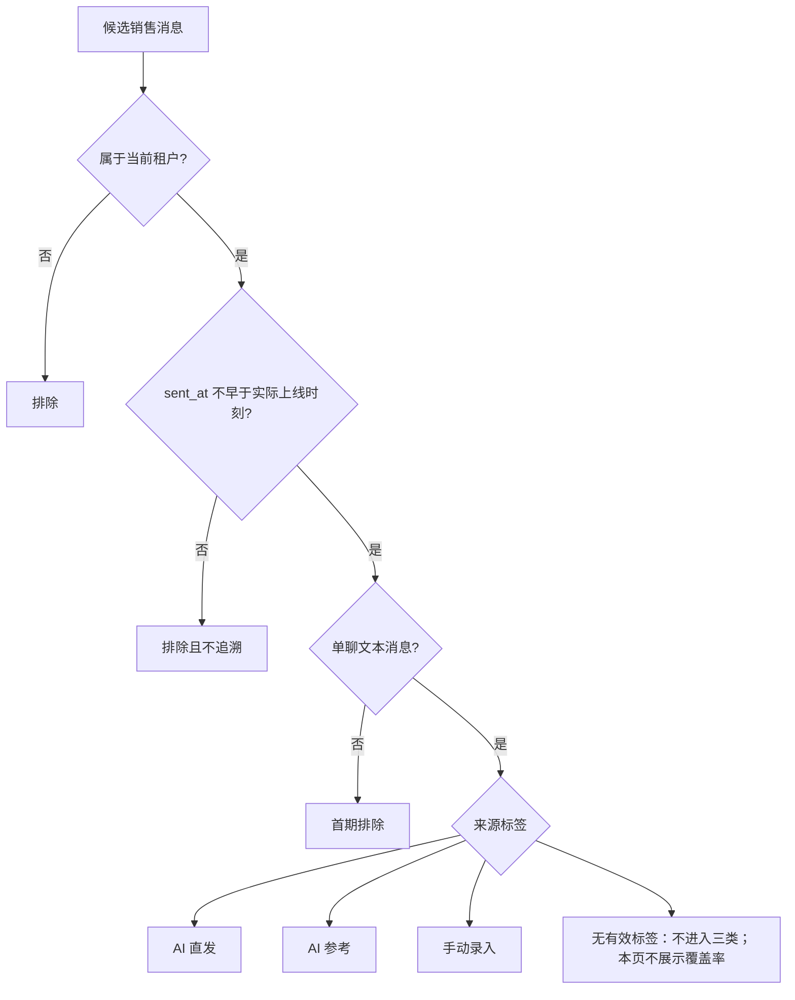

# AI 辅助消息使用统计流程

> Source Contract：`SPEC-SUIYIN-ADMIN-009@1.0.0`
> 更新日期：2026-08-05

## 页面主流程

```mermaid
flowchart TD
    Enter[数据展示 → AI 辅助统计] --> Defaults[本月 / 按销售账号 / 全部部门 / 空关键词]
    Defaults --> Edit[修改快捷日期、自定义日期、部门或关键词]
    Edit --> Search[搜索]
    Search --> Valid{日期区间合法?}
    Valid -->|否| DateError[内联错误；旧结果不刷新]
    Valid -->|是| Scope[锁定当前租户 + 上线时刻 + 单聊文本消息]
    Scope --> Loading[加载骨架]
    Loading --> Permission{有数据展示权限?}
    Permission -->|否| Denied[无权限说明]
    Permission -->|是| Success{统计成功?}
    Success -->|否| Error[失败说明 + 重试]
    Success -->|是| Rows{有结果?}
    Rows -->|否| Empty[完整筛选与表头 + 普通空态]
    Rows -->|是| Table[三类数量 + AI 辅助合计 / 占比]
    Table --> Page[分页 10 / 20 / 50]
```

## 维度切换与聚合

```mermaid
flowchart LR
    Accounts[按销售账号] --> Switch{切换维度}
    Switch -->|按部门| Sum[三类数量按部门成员求和]
    Sum --> Recalc[用部门汇总计数重算占比]
    Recalc --> Departments[部门表：部门 / 账号数 / 三类数量 / 合计占比]
    Switch -->|按销售账号| Accounts
```

## 数据边界

```mermaid
flowchart TD
    Message[候选销售消息] --> Tenant{属于当前租户?}
    Tenant -->|否| Drop1[排除]
    Tenant -->|是| Time{sent_at 不早于实际上线时刻?}
    Time -->|否| Drop2[排除且不追溯]
    Time -->|是| Type{单聊文本消息?}
    Type -->|否| Drop3[首期排除]
    Type -->|是| Label{来源标签}
    Label --> Direct[AI 直发]
    Label --> Reference[AI 参考]
    Label --> Manual[手动录入]
    Label --> Missing[无有效标签：不进入三类；本页不展示覆盖率]
```

本流程只验证使用量统计，不进入客户等级、到店或成交效果归因。
