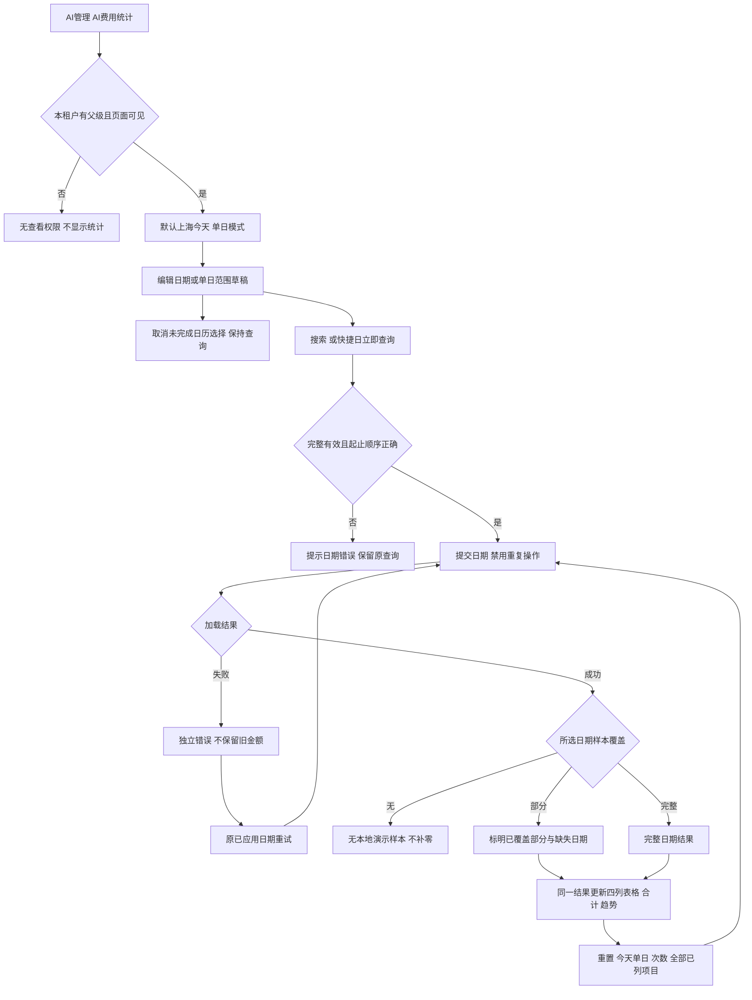
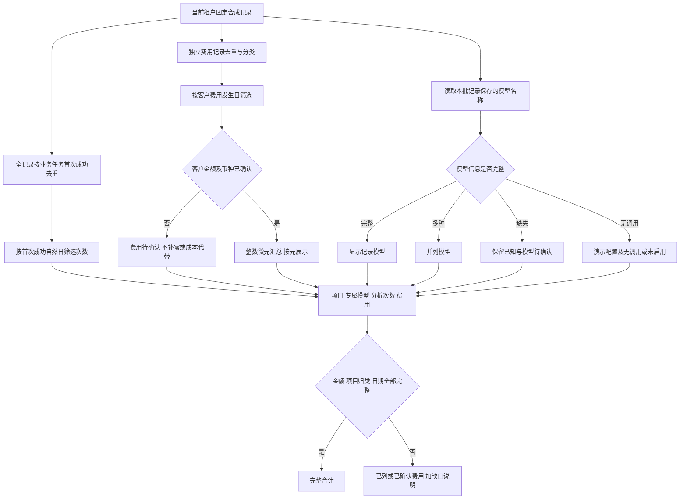
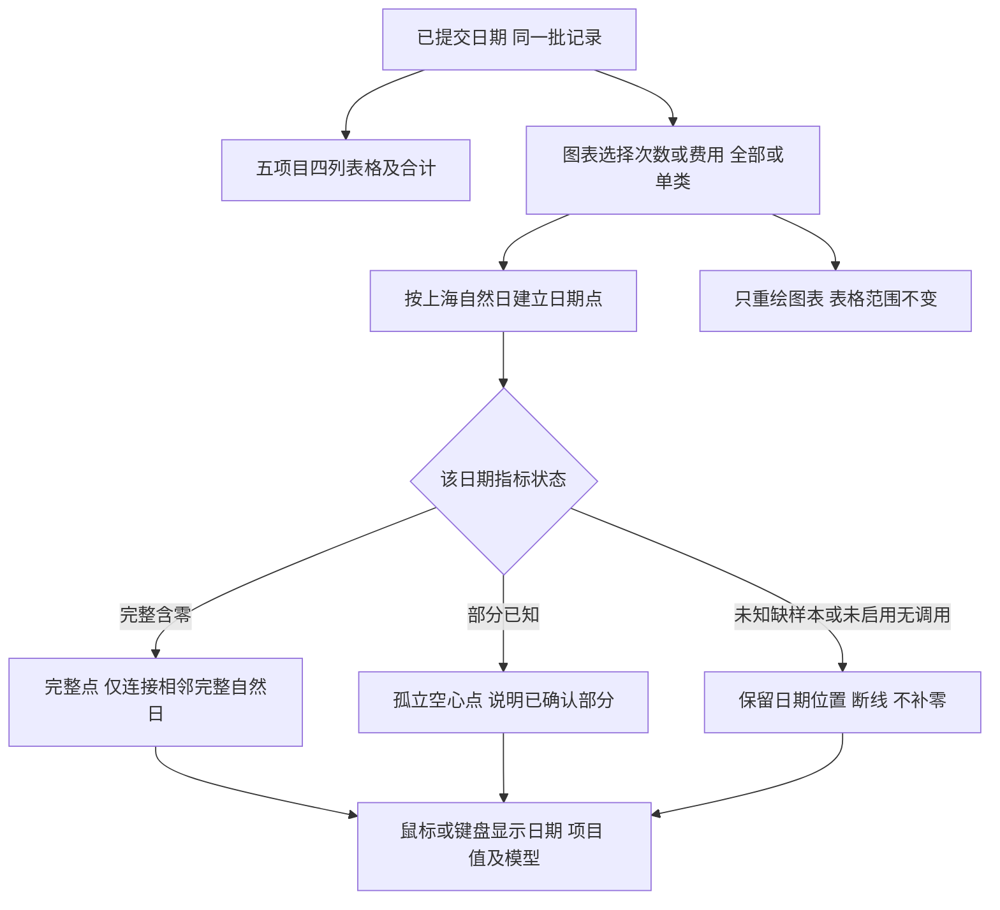

# AI费用统计交互流程

更新：2026-09-20。合同为 [SPEC-SUIYIN-ADMIN-058@1.2.0](../docs/sdd/SPEC-SUIYIN-ADMIN-058/1.2.0/spec.md)。日期、计次、金额、分类趋势与专属模型沿用同一合同；所有节点均为本地静态演示。

## 入口与统一日期查询

固定样本为 2026-07-01 至 2026-09-20，共 82 天；默认日期与重置取上海今天，覆盖外不自动外推。取消不提交，非法查询不覆盖旧结果。

## 次数、费用与模型各自取证

同任务重试不增加成功分析次数；失败有已确认费用时金额仍保留，跨日费用不随成功次数搬日。当前配置不倒灌历史调用，一个模型服务多个项目不重复计费。模型版本缺失不编造。

## 分类趋势与表格的边界

单日仅一个点；全部已列项目为多模型，单类提示显示对应记录模型；参考配置明确为演示配置。不存在双轴、模型筛选、小时粒度或预测趋势。结构、数据、Chrome 静态验收和真实发布分别留证，流程图本身不证明生产调用或扣费。
