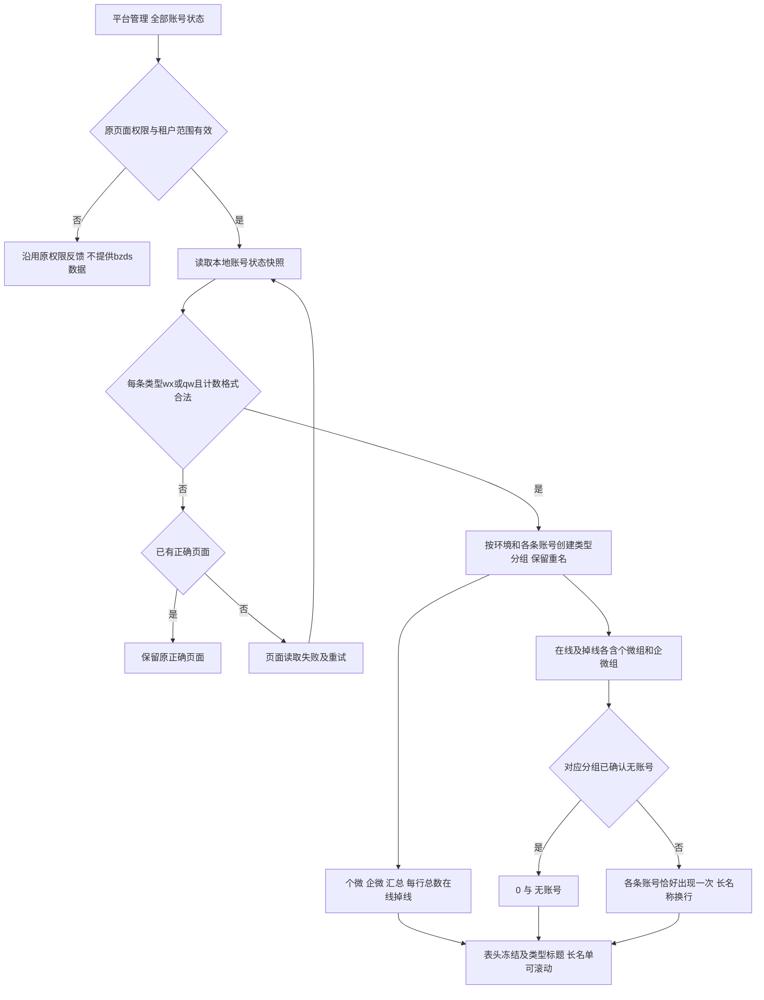
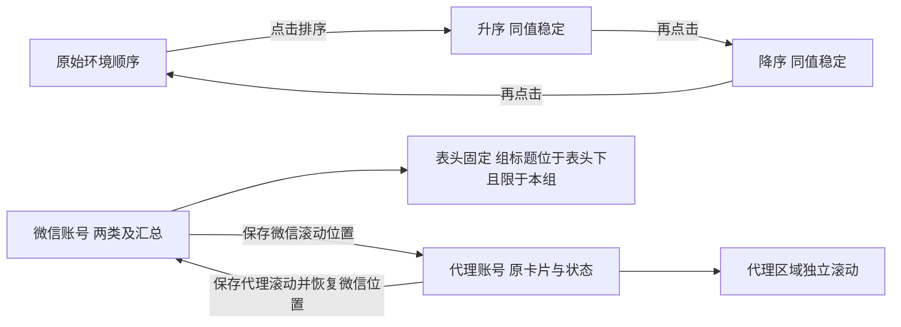

# 全部账号状态交互流程

更新：2026-10-02。执行 [SPEC-SUIYIN-ADMIN-ACCOUNT-TYPE-001@0.2.0](../docs/sdd/SPEC-SUIYIN-ADMIN-ACCOUNT-TYPE-001/0.2.0/spec.md)，产品范围见[产品说明](../prd/all-account-status.md)。仅 `bzds / allWeChatStatus` 使用本专用数据和呈现；其他租户维持原路由与权限。

## 读取、两类与汇总

“待核对”不属于业务流程或类型；旧0.1.0第三分类已由用户纠正撤销。缺/非法类型在开发校验中阻断，不默认个微、不丢条目，不回退旧演示列表。来源汇总与名单条数不一致时保留来源汇总、内部诊断，不静默配平。整行数据已变化时，先形成同批完整快照再显示；明细类型不改变总览在线/掉线口径。

## 排序、页签与滚动

排序、页签可键盘操作并保留可见焦点。代理118卡是本次原型快照而非生产固定规则；读取当前代理样本，已替代2026-09-27未采代理页提示。分类不增加账号创建、编辑、发送、启停或其他真实业务操作。
