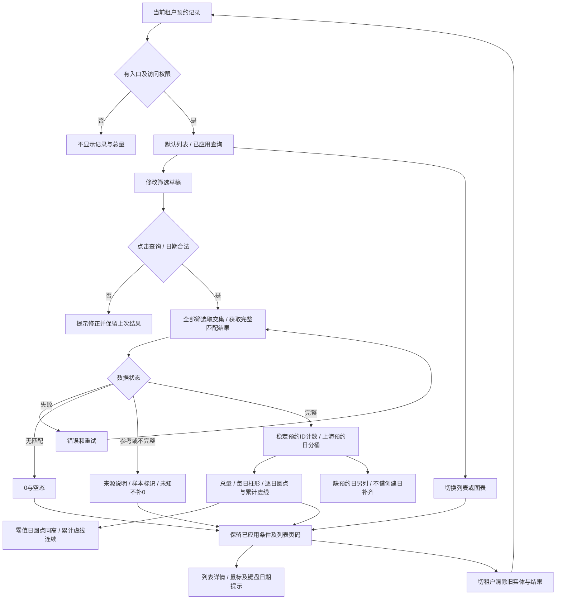

# 预约记录列表与图表流程

唯一合同：[062@1.0.0](../docs/sdd/SPEC-SUIYIN-ADMIN-062/1.0.0/spec.md)。

```mermaid
flowchart TD
    A[当前租户预约记录] --> B{有入口及访问权限}
    B -->|否| C[不显示记录与总量]
    B -->|是| D[默认列表 / 已应用查询]
    D --> E[修改筛选草稿]
    E --> F{点击查询 / 日期合法}
    F -->|否| G[提示修正并保留上次结果]
    F -->|是| H[全部筛选取交集 / 获取完整匹配结果]
    H --> I{数据状态}
    I -->|失败| J[错误和重试]
    J --> H
    I -->|无匹配| K[0与空态]
    I -->|参考或不完整| L[来源说明 / 样本标识 / 未知不补0]
    I -->|完整| M[稳定预约ID计数 / 上海预约日分桶]
    M --> N[总量 / 每日柱形 / 逐日圆点与累计虚线]
    N --> Z[零值日圆点同高 / 累计虚线连续]
    M --> O[缺预约日另列 / 不借创建日补齐]
    D --> P[切换列表或图表]
    P --> Q[保留已应用条件及列表页码]
    N --> Q
    K --> Q
    L --> Q
    Q --> R[列表详情 / 鼠标及键盘日期提示]
    Q --> S[切租户清除旧实体与结果]
    S --> A
```

分页只影响列表展示；按全部匹配记录聚合。原型演示/采样来源独立，生产由正式Issue取得授权范围内的真实统计。无新增导出、下钻、到院或成交指标。
