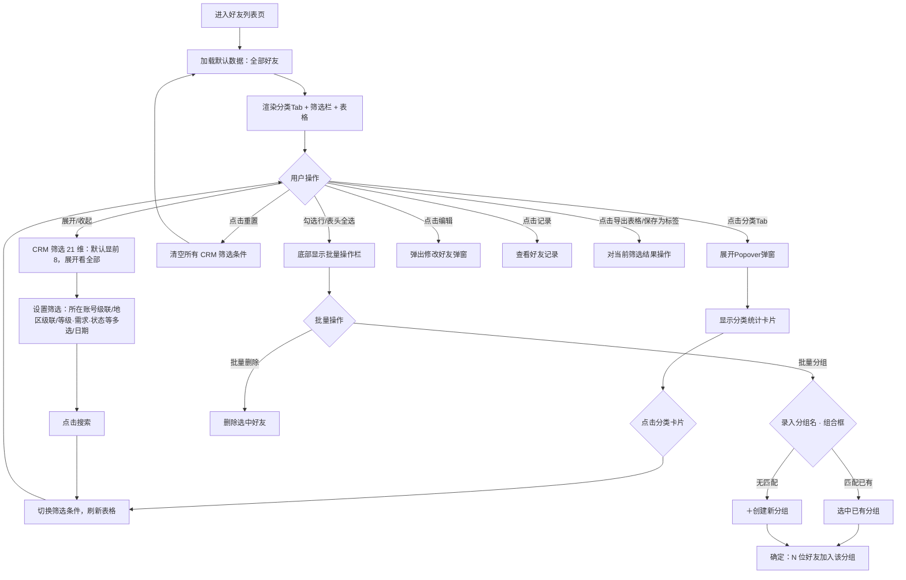
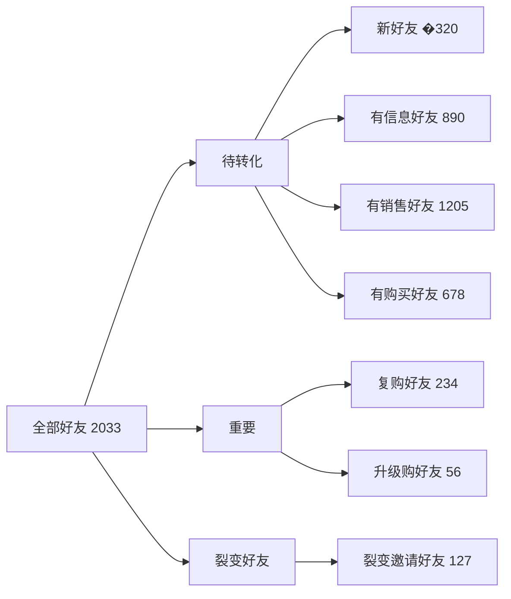

# 好友列表 流程图

## 页面加载流程

```mermaid
flowchart TD
    A[进入好友列表页] --> B[加载默认数据：全部好友]
    B --> C[渲染分类Tab + 筛选栏 + 表格]

    C --> D{用户操作}
    D -->|点击分类Tab| E[展开Popover弹窗]
    E --> F[显示分类统计卡片]
    F --> G{点击分类卡片}
    G --> H[切换筛选条件，刷新表格]
    H --> D

    D -->|展开/收起| I0[CRM 筛选 21 维：默认显前 8，展开看全部]
    I0 --> I[设置筛选：所在账号级联/地区级联/等级·需求·状态等多选/日期]
    I --> J[点击搜索]
    J --> H

    D -->|点击重置| K[清空所有 CRM 筛选条件]
    K --> B

    D -->|勾选行/表头全选| L[底部显示批量操作栏]
    L --> M{批量操作}
    M -->|批量删除| N[删除选中好友]
    M -->|批量分组| G2{录入分组名 · 组合框}
    G2 -->|匹配已有| G3[选中已有分组]
    G2 -->|无匹配| G4[＋创建新分组]
    G3 --> G5[确定：N 位好友加入该分组]
    G4 --> G5

    D -->|点击编辑| P[弹出修改好友弹窗]
    D -->|点击记录| Q[查看好友记录]
    D -->|点击导出表格/保存为标签| R[对当前筛选结果操作]
```

## 分类筛选逻辑

```mermaid
flowchart LR
    A[全部好友 2033] --> B[待转化]
    A --> C[重要]
    A --> D[裂变好友]

    B --> B1[新好友 �320]
    B --> B2[有信息好友 890]
    B --> B3[有销售好友 1205]
    B --> B4[有购买好友 678]

    C --> C1[复购好友 234]
    C --> C2[升级购好友 56]

    D --> D1[裂变邀请好友 127]
```
