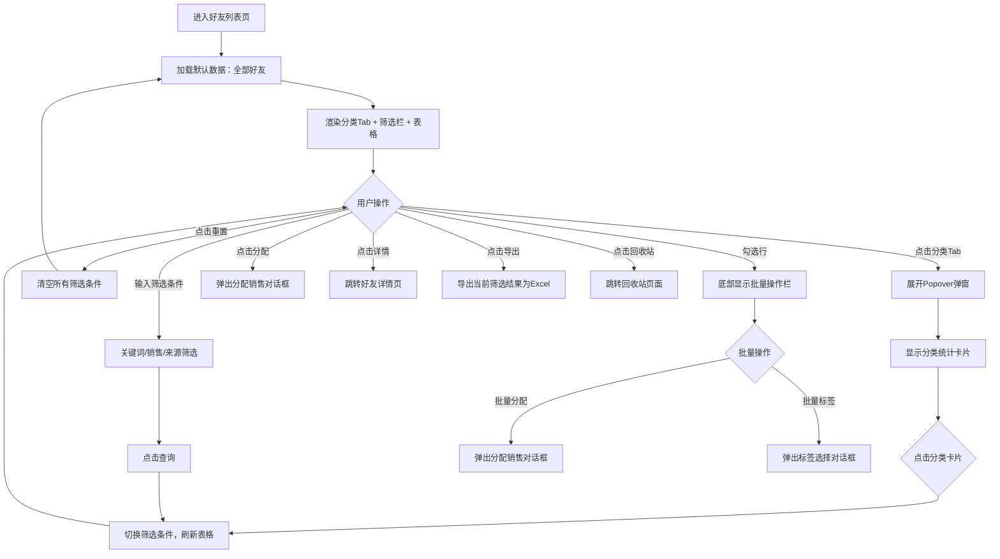
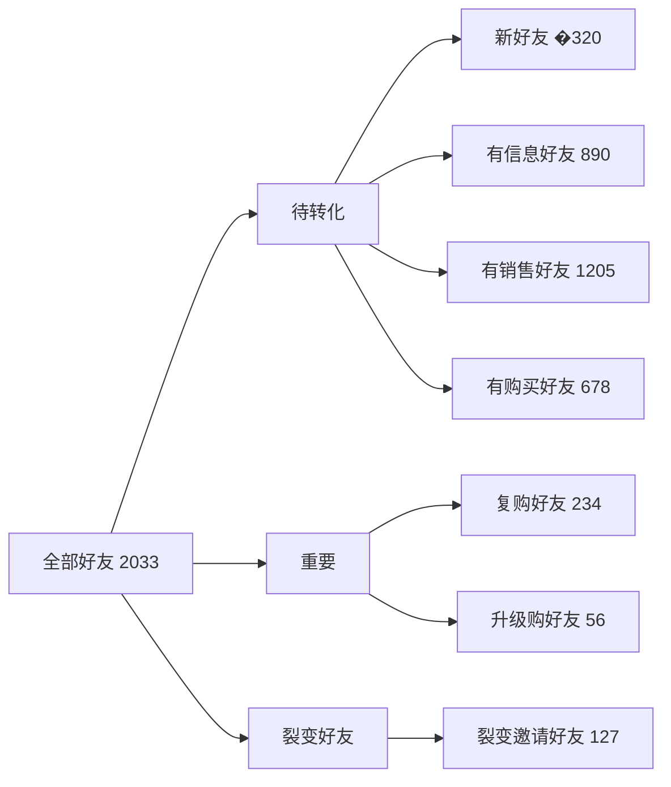

# 好友列表 流程图

## 页面加载流程

```mermaid
flowchart TD
    A[进入好友列表页] --> B[加载默认数据：全部好友]
    B --> C[渲染分类Tab + 筛选栏 + 表格]

    C --> D{用户操作}
    D -->|点击分类Tab| E[展开Popover弹窗]
    E --> F[显示分类统计卡片]
    F --> G{点击分类卡片}
    G --> H[切换筛选条件，刷新表格]
    H --> D

    D -->|输入筛选条件| I[关键词/销售/来源筛选]
    I --> J[点击查询]
    J --> H

    D -->|点击重置| K[清空所有筛选条件]
    K --> B

    D -->|勾选行| L[底部显示批量操作栏]
    L --> M{批量操作}
    M -->|批量分配| N[弹出分配销售对话框]
    M -->|批量标签| O[弹出标签选择对话框]

    D -->|点击分配| P[弹出分配销售对话框]
    D -->|点击详情| Q[跳转好友详情页]
    D -->|点击导出| R[导出当前筛选结果为Excel]
    D -->|点击回收站| S[跳转回收站页面]
```

## 分类筛选逻辑

```mermaid
flowchart LR
    A[全部好友 2033] --> B[待转化]
    A --> C[重要]
    A --> D[裂变好友]

    B --> B1[新好友 �320]
    B --> B2[有信息好友 890]
    B --> B3[有销售好友 1205]
    B --> B4[有购买好友 678]

    C --> C1[复购好友 234]
    C --> C2[升级购好友 56]

    D --> D1[裂变邀请好友 127]
```
