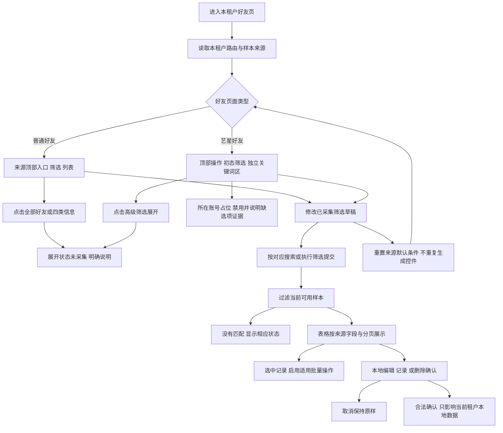

# 好友管理流程

更新：2026-09-20。当前路由为 `customerManagement` 与 `yxCustomerList`，按租户来源分别实现；旧独立页流程已 [归档](../docs/history/before-admin-wide-alignment/README.md)。本图依 051@1.1.0、055/056@1.0.0，不能用于证明未采集展开已完成。

参考内容必须说明来源，不借入其他租户销售或账号。当前保留已知入口不等于分类 Popover、完整高级筛选或账号级联已完成；不得沿用旧流程中的合成分类人数。独立关键词区按来源放置，其与高级条件的完整实站组合语义仍需展开采集核对。
