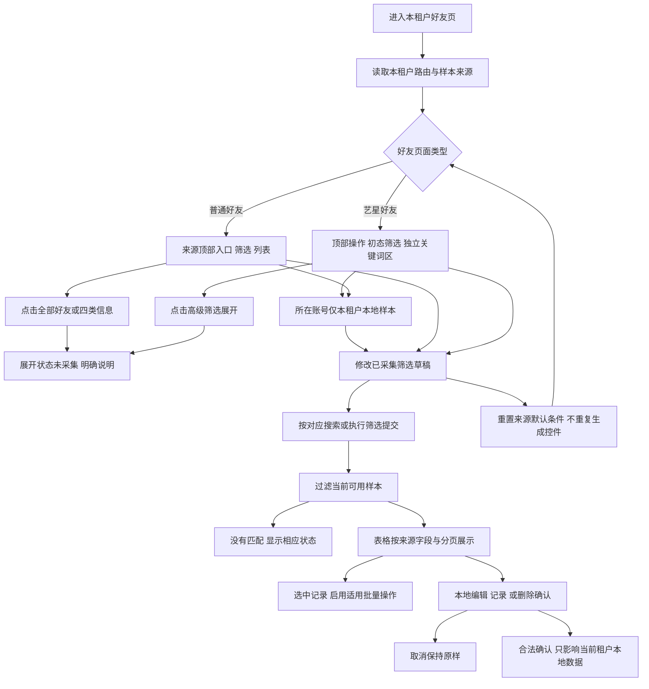

# 好友管理流程

2026-09-30术语适配：按[077@1.0.1](../docs/sdd/SPEC-SUIYIN-ADMIN-077/1.0.1/spec.md)，六艺星及画美/傲丽的系统人员称谓显示为咨询，其他租户仍为销售；下文共享业务定义与历史采集值不改。画美/傲丽仅有最小待采集框架，不据此新增本页权限、数据或菜单。

更新：2026-09-27。当前路由为 `customerManagement` 与 `yxCustomerList`，按租户来源分别实现；旧独立页流程已 [归档](../docs/history/before-admin-wide-alignment/README.md)。好友流程继续依051@1.1.0、055@1.1.0、056@1.0.0；REFRESH-001@0.2.0只承接录音/喜报三新页及对应入口迁移，不能用于证明好友未采集展开已完成。

```mermaid
flowchart TD
    Enter[进入本租户好友页] --> Source[读取本租户路由与样本来源]
    Source --> Route{好友页面类型}
    Route -->|普通好友| Ordinary[来源顶部入口 筛选 列表]
    Route -->|艺星好友| Yestar[顶部操作 初态筛选 独立关键词区]
    Ordinary --> Category[点击全部好友或四类信息]
    Category --> Pending[展开状态未采集 明确说明]
    Yestar --> Expand[点击高级筛选展开]
    Expand --> Pending
    Yestar --> Account[所在账号仅本租户本地样本]
    Ordinary --> Account
    Account --> Draft
    Ordinary --> Draft[修改已采集筛选草稿]
    Yestar --> Draft
    Draft --> Search[按对应搜索或执行筛选提交]
    Search --> Result[过滤当前可用样本]
    Result --> Empty[没有匹配 显示相应状态]
    Result --> Table[表格按来源字段与分页展示]
    Table --> Select[选中记录 启用适用批量操作]
    Table --> Edit[本地编辑 记录 或删除确认]
    Edit --> Cancel[取消保持原样]
    Edit --> Local[合法确认 只影响当前租户本地数据]
    Draft --> Reset[重置来源默认条件 不重复生成控件]
    Reset --> Route
```

参考内容必须说明来源，不借入其他租户销售或账号。当前保留已知入口不等于分类 Popover、完整高级筛选或账号级联已完成；不得沿用旧流程中的合成分类人数。独立关键词区按来源放置，其与高级条件的完整实站组合语义仍需展开采集核对。
