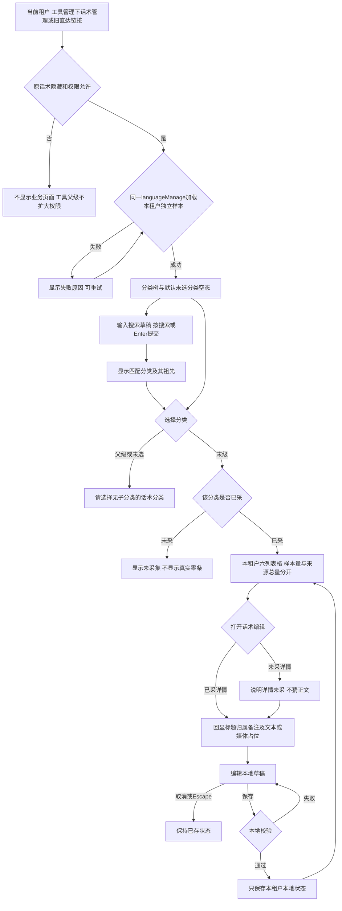
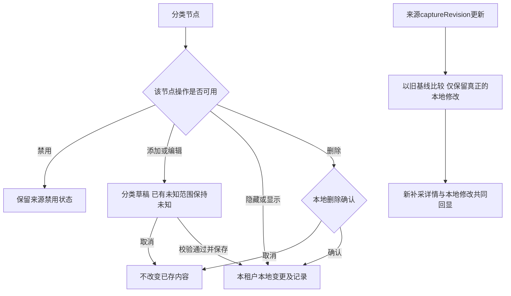

# 话术管理流程

2026-09-30术语适配：按[077@1.0.1](../docs/sdd/SPEC-SUIYIN-ADMIN-077/1.0.1/spec.md)，六艺星及画美/傲丽的系统人员称谓显示为咨询，其他租户仍为销售；下文共享业务定义与历史采集值不改。画美/傲丽仅有最小待采集框架，不据此新增本页权限、数据或菜单。

更新：2026-09-29。入口按[073@1.0.0](../docs/sdd/SPEC-SUIYIN-ADMIN-073/1.0.0/spec.md)的R001–R003改为工具管理下二级话术，原路由与隐藏/权限、本地业务状态保持。页面继续继承[051@1.1.0](../docs/sdd/SPEC-SUIYIN-ADMIN-051/1.1.0/spec.md)的R002–R006、R008–R010。流程仅作用于当前浏览器的本地原型；数据范围见[产品说明](../prd/language-manage.md)。

分类显示状态来自本轮图标采样，未在真实后台点击隐藏/删除/保存；图中操作均为本地反馈。部门、销售和商品候选项按本租户已采范围提供，未采字段不转换成“全部”或其他租户选项。新增本地内容与源样本分开，媒体仅占位。
