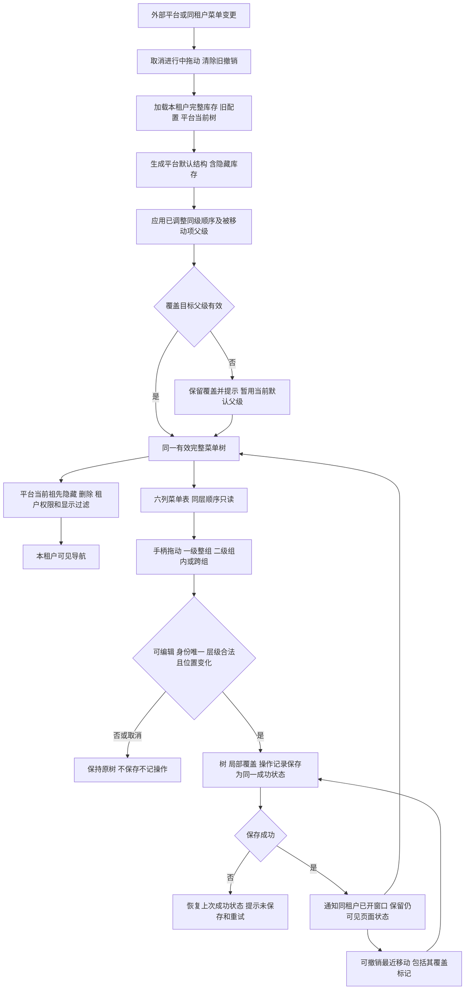
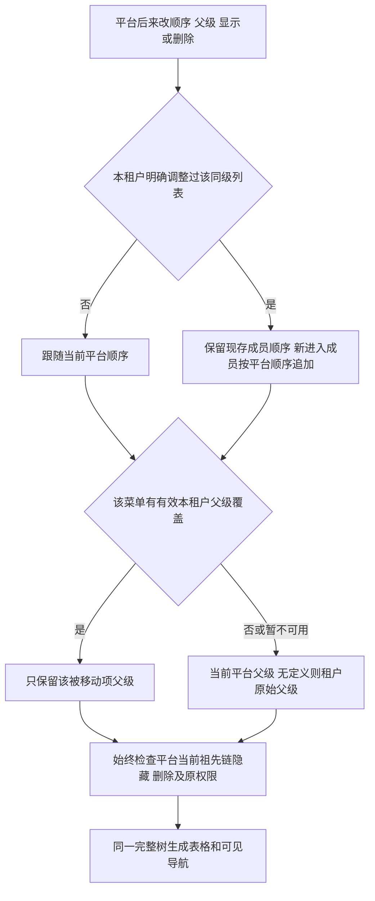

# 各租户菜单拖动与导航联动流程

合同：[SPEC-SUIYIN-ADMIN-068@1.0.0](../docs/sdd/SPEC-SUIYIN-ADMIN-068/1.0.0/spec.md)。普通menu作用当前租户；平台allMenu仍通过默认结构和可见性规则影响全部租户。

刷新或后续数据修改清除会话撤销；单纯展开、滚动、打开后取消弹窗保留撤销。一级空组和隐藏项不从库存丢失，携页一级保留自身入口。异常重复身份/路由保留原数据并暂禁整树拖动，导航安全投影仍执行已有平台限制和租户覆盖；修复后恢复正常操作。所有保存都是静态原型本地行为，生产持久化和权限由正式工程流程实施。
