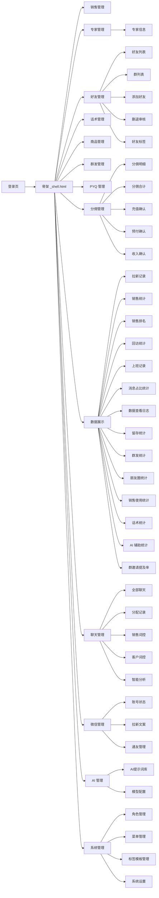
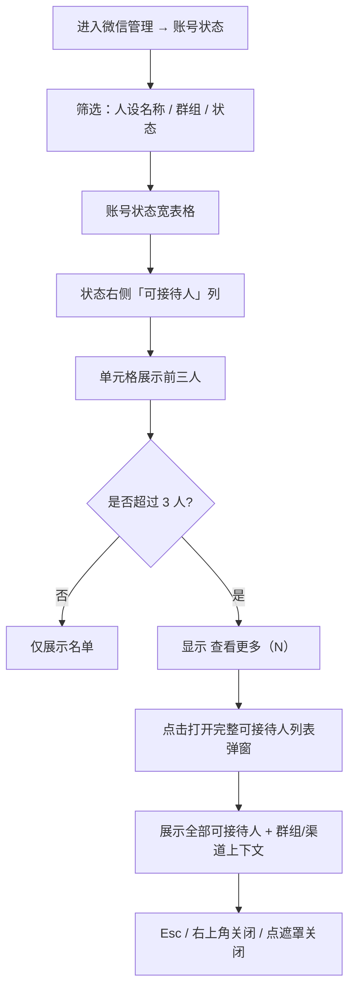
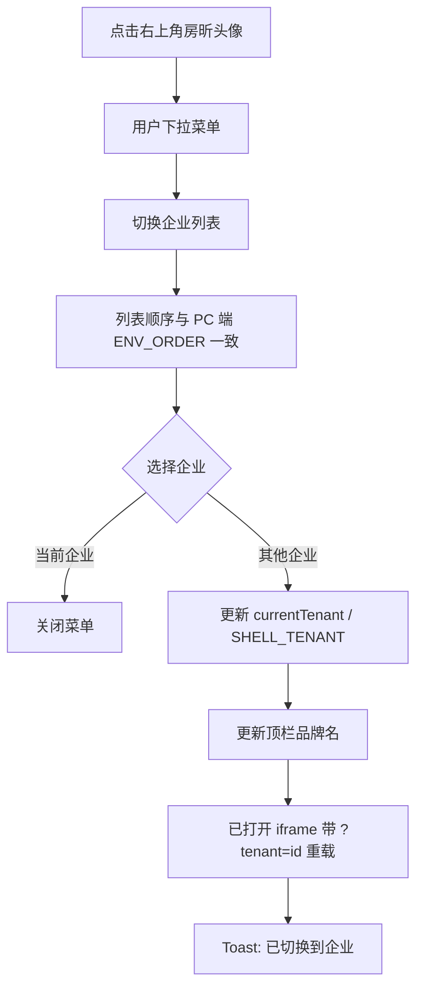
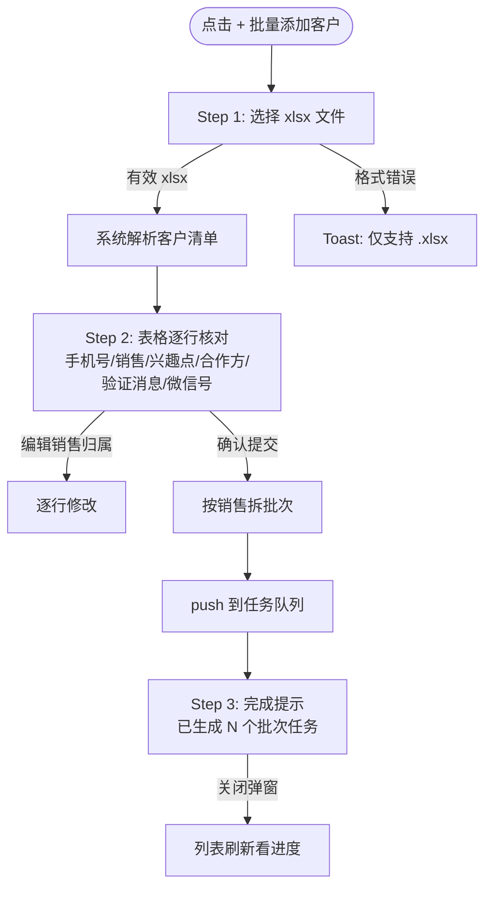
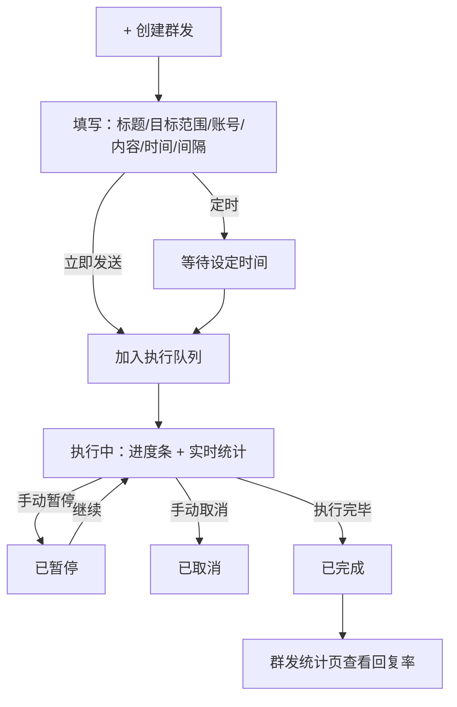
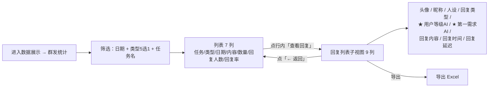
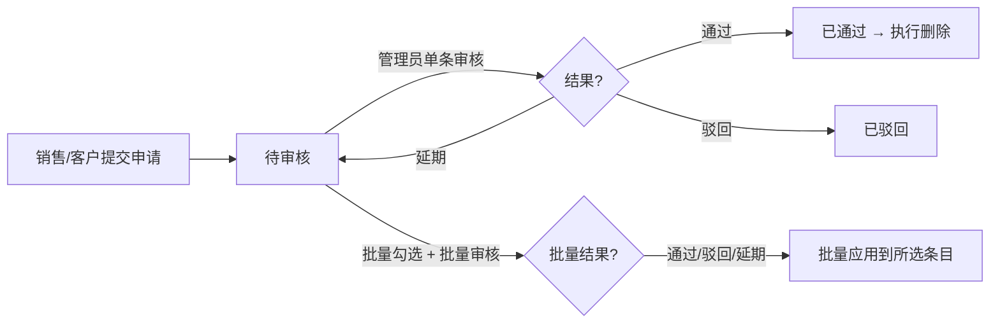
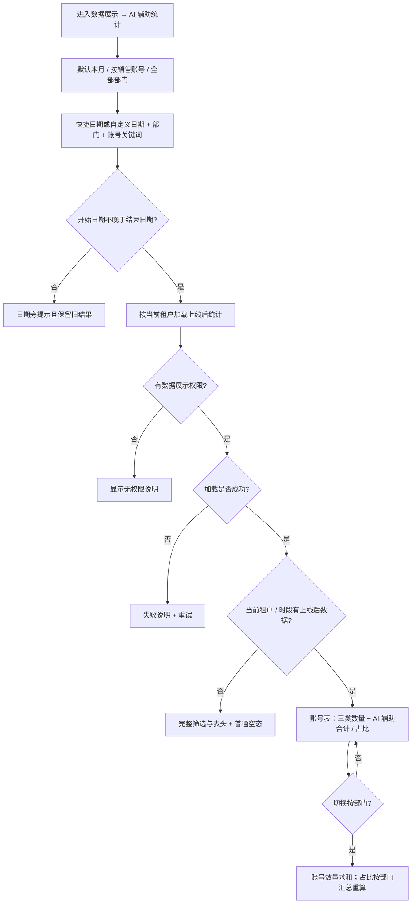

# 管理后台 v1.1 站点地图 + 主流程

## 站点地图



## 主交互流程：账号状态 → 查看可接待人（2026-07-17）



## 主交互流程：右上角头像 → 切换企业（同步 PC 列表）



## 主交互流程：批量添加客户（3 步向导）



## 主交互流程：群发管理（创建 → 监控 → 复盘）



## 主交互流程：群发统计 → 回复列表（2026-05-25）




## 主交互流程：删退审核



## 主交互流程：群邀请提及率（管理者催办路径）

```mermaid
flowchart TD
    Enter[进入数据展示 → 群邀请提及率] --> Filter[选择时段 + 维度 + 群多选]
    Filter --> Sort[列表按提及率升序<br/>最差靠前]
    Sort --> Pick{管理者关注哪行?}
    Pick -->|看销售个体差异| Click1[点销售行的"明细"按钮]
    Pick -->|直接催办未邀清单| Click2[点红色"未邀好友 N 人"]
    Click1 --> Modal[明细 modal · 默认未邀 tab]
    Click2 --> Modal
    Modal -->|按加好友时间倒序| UnList[未邀清单<br/>最新加的好友最紧急]
    Modal -->|切换 tab| InList[已邀清单<br/>含邀请话术原文 + 邀请时间]
    UnList -->|线下找销售沟通| Action[催办销售跟进]
    Action --> Recheck[隔几天回查提及率是否上升]
```

## 主交互流程：AI 辅助统计（2026-08-05）



详细状态与统计口径见 `flowcharts/ai-assisted-message-stats.md` 与 `SPEC-SUIYIN-ADMIN-009@1.0.0`。
